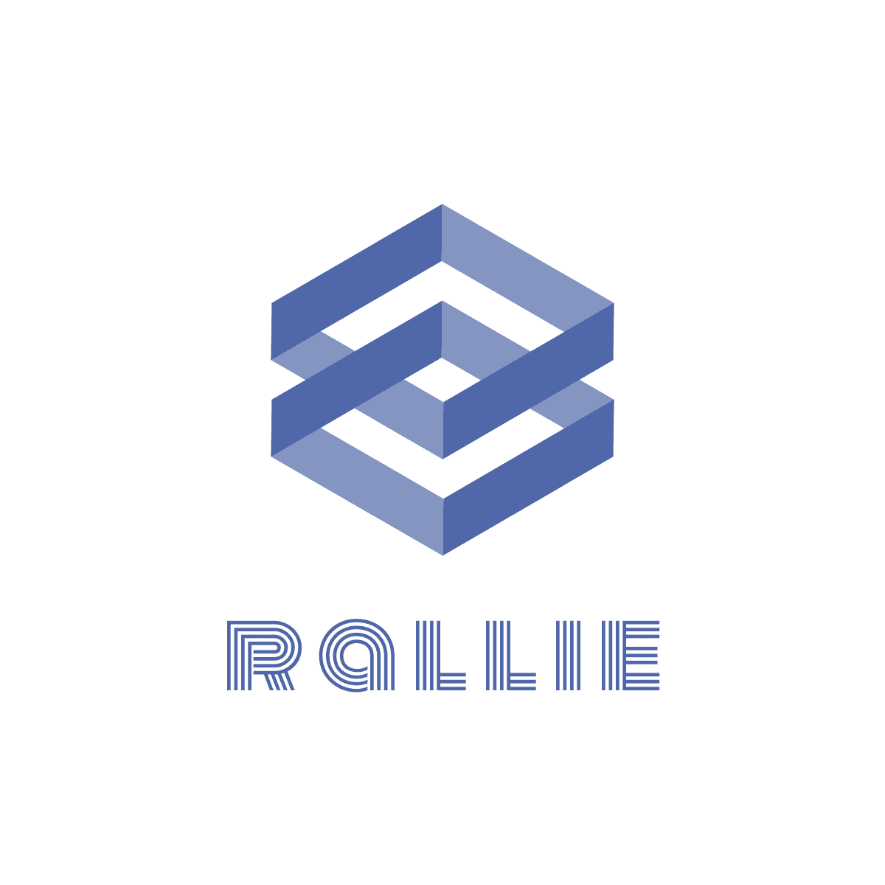

  
    

     

[简体中文](https://github.com/ralliejs/rallie/blob/master/README.zh.md) ｜ English

> WIP: the library is under heavy development, do not use it in production enviroment. The old document and README are deprecated, the new version is being written

## Introduction
Rallie is a library that can help users implement decentralized front-end micro service architecture. The front-end application developed based on rallie can become a service that exposes responsive states, events and methods. Different services can share dependencies, flexibly combine and arrange, so as to improve the scalability of large-scale front-end applications

## Features
- **Decentralized service arrangement**: there is no concept like main-application and sub-application, everything is service, and the dependencies between services are managed and arranged by rallie
- **communication between services**: services can expose reactive states based on `@vue/reactivity` along with events and methods based on proxy
- **Middleware**: The middleware mechanism based on `koa-compose` makes the process of loading application's resource become really flexible and scalable
- **Support mainstream front-end technology**: rallie is friendly to typescript, and supports vue2, vue3, react and vanilla js
## Example
- code: [https://github.com/ralliejs/rallie/tree/master/packages/playground](https://github.com/ralliejs/rallie/tree/master/packages/playground)
- preview: [https://ralliejs.github.io/rallie/index.html](https://ralliejs.github.io/rallie/index.html)

## Ecosystem
- [@rallie/react](https://github.com/ralliejs/rallie/tree/master/packages/react): support react services by providing hooks
- [@rallie/vue](https://github.com/ralliejs/rallie/tree/master/packages/vue): support vue3 services by providing composition api and support vue2 services by providing mixins
- [@rallie/load-html](https://github.com/ralliejs/rallie/tree/master/packages/load-html): A middleware that allows services load resources directly from HTML
## Document
to do

## License
rallie is [MIT Licensed](https://github.com/ralliejs/rallie/blob/master/LICENSE)
