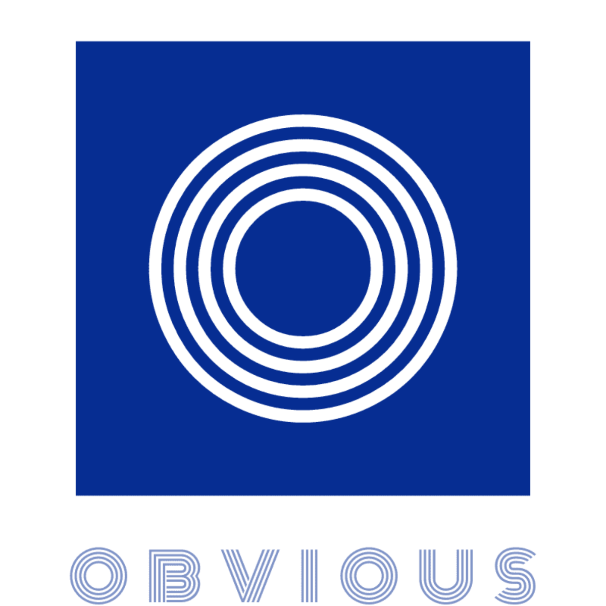

<div align="center">
  
  <br><br>

  [](https://coveralls.io/github/ObviousJs/obvious-core?branch=master) [](https://github.com/ObviousJs/obvious-core/releases) [](https://github.com/ObviousJs/obvious-core/commits/master) [](https://github.com/ObviousJs/obvious-core/blob/master/README.zh.md)
</div>

> it's an experimental libarary now, do not use in production enviroment

[简体中文](https://github.com/ObviousJs/obvious-core/blob/master/README.zh.md) ｜ English

## Introduction
Obvious is a progressive micro-front-end library. In the micro-front-end architecture, Obvious focuses on solving the  problem of scheduling and communication between micro frontend applications. It aims to help users quickly build a basic micro-front-end system and support deeper customization to achieve a complete and reliable micro-front-end architecture by providing easy-to-understand APIs and flexible middlewares.

## Features
- Provide flexible and convenient communication capabilities based on global state, event broadcast, and event unicast
- Support declaring dependencies when defining micro applications, and automatically activate dependencies when activating micro applications, allowing micro applications to be freely split and combine
- Provide a flexible middleware mechanism: users can flexibly control the resource loading and execution process of micro-applications by writing middleware, thereby elegantly expanding functions such as automatic registration of micro-application resources, logs, html-entry and js sandboxes
- Naturally supports loading multiple micro-applications in a single-screen page, based on which a high-end spa micro-front-end framework can be encapsulated, and the activation conditions of the micro-applications are completely freely set by the developer, no longer limited to routing hijacking.
- The concept is simple, the functional API is clear and easy to understand, and it can be developed without documentation

## Installation
npm: 

`npm install obvious-core`

umd:

`<script src="https://unpkg.com/obvious-core@{version}/dist/index.umd.js"></script>`

## Quick Start

In host enviroment, create a bus and declare the resource info
```js
import { touchBus } from 'obvious-core';

const [bus] = touchBus()
bus.config({
  assets: {
    'react-app': {
      js: [
        'http://localhost:3000/static/js/bundle.js',
        'http://localhost:3000/static/js/0.chunk.js',
        'http://localhost:3000/static/js/main.chunk.js'
      ]
    },
    'vue-app': {
      js: [
        'http://localhost:8081/js/app.js',
        'http://localhost:8081/js/chunk-vendors.js'
      ]
    }
  }
});
```

micro frontend application can get the bus, and create an App with it, at the same time, a socket can be created to communicate with other App

vue-app
```ts
import Vue from 'vue';
import App from './App.vue';
import { touchBus } from 'obvious-core';

Vue.config.productionTip = false;

const [bus] = touchBus();
const socket = bus.createSocket();

type BroadcastType = {
  broadcastEvent: () => void
};

type UnicastType = {
  unicastEvent: () => void
}

const off = {};
let vm = null

bus.createApp('vue-app')
  .relyOn(['vue'])
  .bootstrap(async (config) => {
    off.unicast = socket.onUnicast<UnicastType>({
      unicastEvent() {
        // do something
      }
    });
    off.broadcast = socket.onBroadcast<BroadcastType>({
      broadcastEvent() {
        // do something
      }
    });
    const [user, theme] = await socket.waitState(['user', 'theme']);
    socket.setState('theme', theme => {
      theme.value = 'dark';
    });
    socket.watchState('user', user => user.name).do((userName) => {
      // do something
    });
    vm = new Vue({
      render: h => h(App),
    }).$mount(config.mountPoint);
  })
  .destroy(() => {
    vm.$destroy();
    off.broadcast();
    off.unicast();
  });
```

react-app
```ts
import React from 'react';
import ReactDOM from 'react-dom';
import { touchBus } from 'obvious-core';

type BroadcastType = {
  broadcastEvent: () => void
};

type UnicastType = {
  unicastEvent: () => void
}

const [bus] = touchBus();
const socket = bus.createSocket();
const broadcaster = socket.createBroadcaster();
const unicaster = socket.createUnicaster();

bus.createApp('react-app')
  .relyOn(['react'])
  .bootstrap(async (config) => {
    broadcaster.broadcastEvent();
    unicaster.unicastEvent();
    socket.initState('user', { name: 'Philip' });
    socket.initState('theme', { value: 'light' });
    console.log(socket.getState('theme', theme => theme.value));
    ReactDOM.render(<App />, document.querySelector(config.mountPoint));
  });
```

In host enviroment, activate the application
```js
bus.activateApp('react-app', {mountPoint: document.getElementById('#react-app')});
bus.activateApp('vue-app', {mountPoint: document.getElementById('#vue-app')});
```

## Example


```
npm run demo:install
npm run demo:react
npm run demo:vue
npm run demo:host
```

## Document

[obvious.js: the progressive micro frontend library](https://obviousjs.github.io/obvious-core/#/en/) (Not the latest)

## License
obvious is [MIT Licensed](https://github.com/ObviousJs/obvious-core/blob/master/LICENSE)
