# Introduction
-----------
Obvious is a progressive micro front-end library. In the micro front-end architecture, Obvious focuses on solving the problem of arrangement and communication between micro frontend applications. It aims to help users quickly build a basic micro front-end system and support deeper customization to achieve a complete and reliable micro front-end architecture by providing APIs easy to understand and flexible middlewares.

## About micro front end
In software engineering, the front end is a field with fast speed of iterative and update. Objectively speaking, technology evolution is the result of the increase of problem's complexity and qualitative change caused by quantitative change. After the emergence of new technologies, more complex problems can be solved, and on the contrary, it drives the increase of problem's complexity. Therefore, the rapid update of the front-end shows that the front-end can do more and more things in the business, and its status is becoming more and more important.

A few years ago, the front-end developers only made some static pages and handled simple interactions. At that time, operating the native DOM or using the the sharp jQuery is enough to complete the work. Later, the popularity of Ajax brought a wave of front-end and back-end separation，much back-end developers's work was handled over to the front-end developers，they need to map a large amount of data to the UI, which means that it becomes extremely painful for developers to manually operate the DOM. At this time, The emergence of three epic projects, Angular, React and Vue, saved front-end developers in dire straits. The function of these three frameworks is to automatically map the data to the DOM in real time, so that developers can only focus on the data without operating the DOM。And then, the emergence of single page applications makes it possible to transfer data between pages without going through the backend, which makes the front end applications become more and more huge and complex. For some to-B applications, sometimes there are dozens or even hundreds of pages to manage, which can easily become fragile and difficult to maintain applications. At this time, the qualitative change caused by quantitative change is the emergence of micro front-end architecture.

We hope to introduce an architecture like back-end microservices, so that a huge front-end application can be separate to several micro applications which have the features below:
1. The technology stack between micro applications is decoupled, not aware of each other, and can be upgraded independently.
2. Each micro application provides relatively independent functions, which are developed and maintained by relatively independent teams.
3. Each micro application can be deployed and published separately, and then arranged and aggregated in a host application which is the collection of many micro applications.
4. After aggregation, micro applications have the ability to communicate with each other and can exchange data across scripts

> [micro frontend](https://martinfowler.com/articles/micro-frontends.html)

## Industry practice
Micro front end is not a new concept，but also not old either. At present, the well-known open source micro front-end frameworks include [single-spa](https://single-spa.js.org/), Alibaba's [qiankun](https://qiankun.umijs.org/zh/guide) based on single-spa. and the relatively independent micro front-end framework  [icestark](https://ice.work/docs/icestark/about) which is also from Alibaba. At the same time, in various front-end conferences, many companies also shared their own micro front-end solutions. By integrating various materials on the network, we can roughly summarize several problems to be solved in the process of micro front-end landing:

1. How to register and load the resources of micro application（Arrangement）
2. How to communicate between micro applications（Communication）
3. How to ensure that global variables and styles do not affect each other between micro applications（Container）

## About Obvious
I have experienced several open source or internal micro front-end solutions in the actual business. In the process of development, I found that for the three problems mentioned above, solving the first two is more urgent. Whether there is a flexible and elegant registration and loading mechanism and convenient communication mechanism is an important indicator to measure the experience to users for a micro front-end framework. Unfortunately, I personally feel that the liraries or frameworks I tried did not give me a good experience。In China, the topic of micro front end seems to focus too much on the realization of "container"，the things like JS sandbox sound cool, but in my opinion, it seems to be a icing on the cake, in some cases, it even brings me trouble。It is for the above reasons that I came up with the idea of writing my own micro front-end framework, so I had Obvious.js

Obvious.js is a lightweight and progressive micro front-end library. It focuses on solving the arrangement and communication problems for micro applications. Its characteristics are:
- It provides the communication capability based on global state, event broadcast and event unicast, and the communication mechanism is flexible and convenient
- It supports declaring dependencies when defining micro applications. when activating micro applications it will automatically activating its dependencies, so that micro applications can be split and combined freely
- Provide flexible middleware mechanism. Users can flexibly control the loading and execution process of micro applications's resources by writing middlewares, so as to gracefully expand the functions of automatic registration of micro application resources, logs, HTML entry and JS sandbox
- It naturally supports loading multiple micro applications in a single screen page, and can encapsulate a high-level spa micro front-end framework based on it. At the same time, the micro application activation conditions are completely set by the developer, which is no longer limited to route hijacking
- The concept is simple, the API is clear and easy to understand. After learning it, users can develop with it without documentation.

This is a project I developed in my spare time. If it can help you solve business problems or inspire you. I hope you can give my [repository](https://github.com/ObviousJs/obvious-core) a star. It would be better if you would like to mention issues or PR to help me improve it。

Next, I will take you to develop a demo to go into the world of Obvious.js

# Tutorial
---------
> This tutorial assumes that you master the basic knowledge of React and Vue, if you don't，we recommand that you should learn them first.

## Target

After learning this tutorial, you will develop a simple micro front-end application like the above：
- A react project created with create-react-app is deployed in http://localhost:3000
- A vue project created with vue-cli is deployed in http://localhost:3000
- The above two projects are combined into one in http://localhost:9999:
  - The text input in the input box in the react area can be displayed in real time as a title in the vue area
  - In the Vue area, you can click the green button to control whether the react icon rotates
  - Click the title in the Vue area, and the input box in the react area gets the focus

You can view the source code of the tutorial example [here](https://github.com/ObviousJs/obvious-core/tree/master/examples)

## Prepare
First, we create an app named react-app with [create-react-app](https://github.com/facebook/create-react-app#creating-an-app) and an app named vue-app with [vue-cli](https://cli.vuejs.org/)

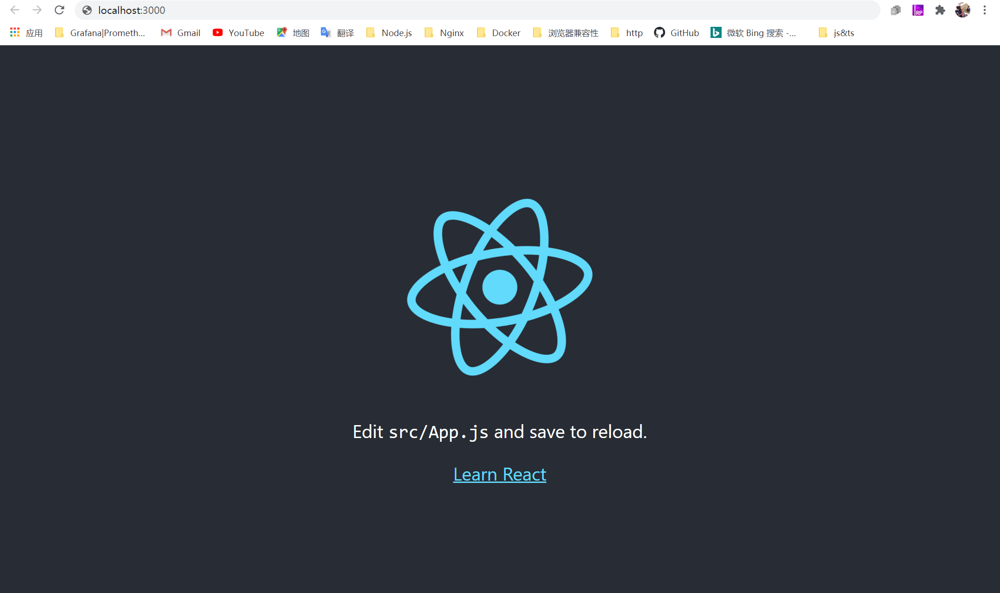

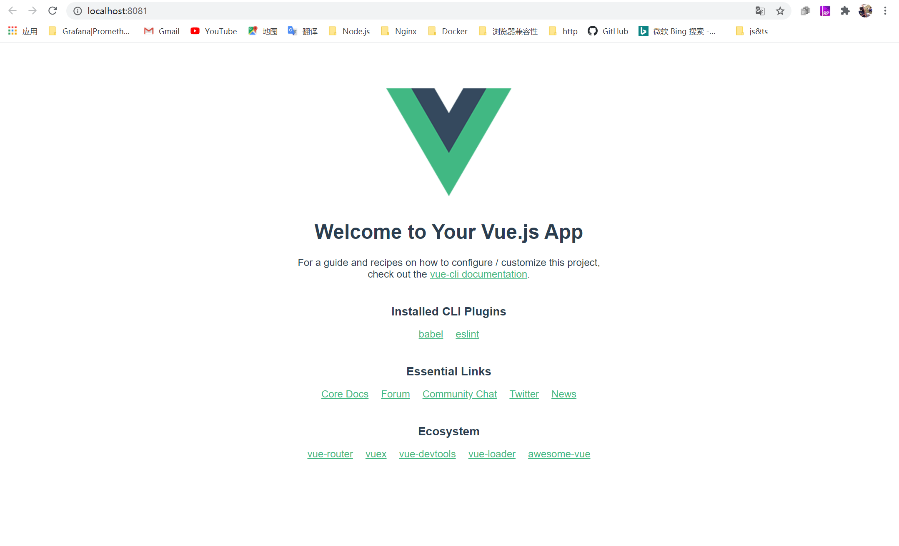

And then, we modify the mount point, the style and the public path of the two projects so that we can combine them into one later.

The react-app is modified as follows:

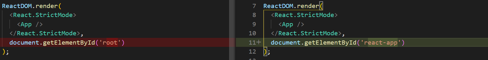
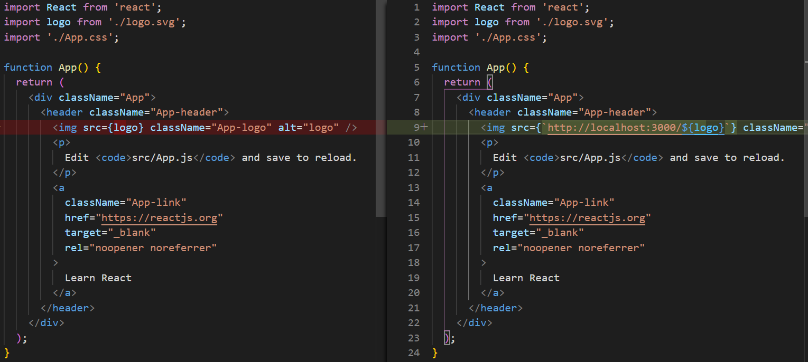
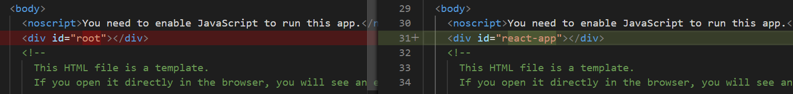

The vue-app is modified as follows:

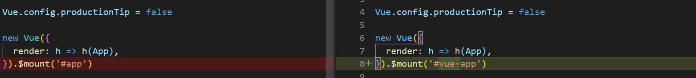
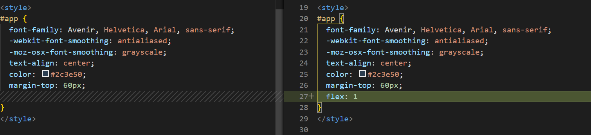
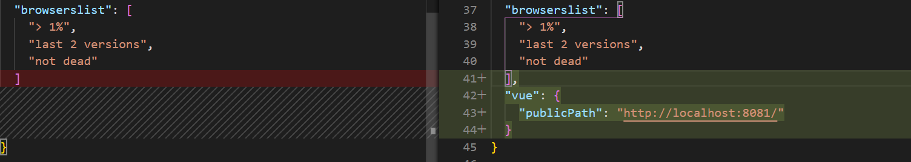
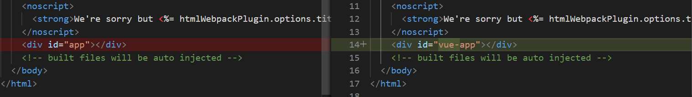

We're finally going to put these two apps in http://localhost:9999, so we need to build a host environment.

> If you don't know some basic knowledge about webpack and node.js, the following parts may make you feel a little difficult to understand, you can copy the code in the tutorial directly without understanding why.

Because react-app and vue-app are served by webpack-dev-server, their source code will carry the code to realize the function of HMR. If the host environment is also served by webpack-dev-server, the wrong hot-update request will cause the host environment dev server to hang up. Therefore，we choose to use webpack to package the host code in watch mode, and use node.js to start the HTTP server. Since this example is only demonstrated on modern browsers, our webpack configuration is as simple as posibble. We only use an html-webpack-plugin to inject the packaged code into the HTML template.
```js
// ./host-enviroment/main.js
alert("I'm ready to learn obvious.js");
```
```js
// ./host-enviroment/webpack.config.js
const path = require('path');
const HtmlWebpackPlugin = require('html-webpack-plugin');

module.exports = () => {
    const entry = {
        'main': path.resolve(__dirname, './main.js')
    };

    const plugins = [
        new HtmlWebpackPlugin({
            template: path.join(__dirname, './index.template.html')
        })
    ];

    return {
        entry,
        devtool: 'source-map',
        plugins
    }
};
```
In our hosted html, we need to reserve mount points for react-app and vue-app and have a style where each app accounts for half of the screen.
```html
<!--  ./host-enviroment/index.template.html   -->
<!DOCTYPE html>
<html lang="en">
    <meta charset="utf-8">
    <meta http-equiv="X-UA-Compatible" content="IE=edge">
    <meta name="viewport" content="width=device-width,initial-scale=1.0">
    <title>obvious demo</title>
    <style>
        body {
            display: flex;
        }

        #react-app {
            flex: 1;
        }

        #vue-app {
            flex: 1
        }
    </style>
  </head>
  <body>
    <noscript>
      <strong>We're sorry but obvious demo doesn't work properly without JavaScript enabled. Please enable it to continue.</strong>
    </noscript>
    <div id='react-app'></div>
    <div id="vue-app"></div>
    <!-- built files will be auto injected -->
  </body>
</html>
```
After packaging, all the static resources of the host-enviroment will be packaged into the '. /dist' directory, then we use express to serve it in http://localhost:9999
```js
// ./host-enviroment/server.js
const express = require('express');
const child_process = require('child_process');
const path = require('path');
const fs = require('fs');

const app = new express();

if (!fs.existsSync('./dist')) {
    fs.mkdirSync('./dist');
}

const childProcess = child_process.exec('npm run watch');
childProcess.stdout.pipe(process.stdout);
childProcess.stderr.pipe(process.stderr);

app.use(express.static(path.join(__dirname, './dist/')));

app.listen('9999', () => {
    setTimeout(() => {
        child_process.execSync('start http://localhost:9999/index.html');
    }, 3000);
});
```
At last, we configure the NPM script
```json
// ./host-enviroment/package.json
{
  "name": "host-enviroment",
  "version": "0.1.0",
  "description": "",
  "main": "index.js",
  "scripts": {
    "test": "echo \"Error: no test specified\" && exit 1",
    "watch": "webpack -w",
    "start": "node ./server.js"
  },
  "author": "",
  "license": "ISC",
  "devDependencies": {
    "express": "^4.17.1",
    "html-webpack-plugin": "^4.3.0",
    "webpack": "^4.44.0",
    "webpack-cli": "^3.3.12"
  }
}
```
This completes the first step in building your first obvious application
```
|--- react-app
|--- vue-app
|--- host-enviroment
    |--- main.js
    |--- index.template.html
    |--- server.js
    |--- webpack.config.js
    |--- package.json
```
Execute 'npm start' on host-enviroment. http://localhost:9999 Opens
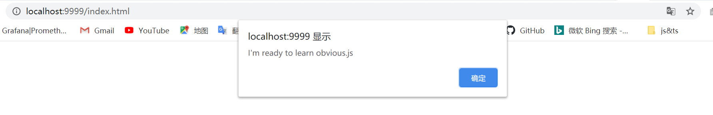

Finally, let's install the dependency in all three projects: `npm install obvious-core`

?> <strong>You are ready to learn obvious.js</strong>

## Resource registration and loading
It is not difficult to understand that pages can be rendered on react-app and vue-app because js code containing rendering logic is loaded

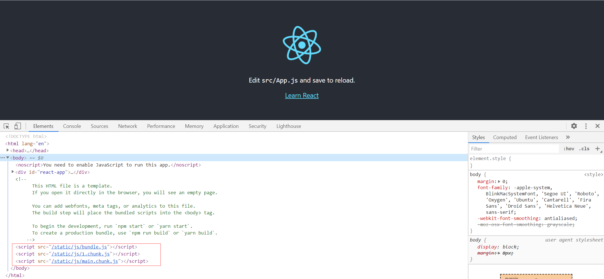


Now, we just need to do the same thing if we want to aggregate the two applications in http://localhost:9999.

?> By analogy to the concept of back-end, a back-end micro service is essentially one or more processes that schedule the resources of the OS，The essence of a front-end micro application is one or more scripts that schedule the DOM resources.

In Obvious, this job is done by an object called 'Bus'. It is the kernel of the whole micro front-end system and the center to arrange different micro applications.

```js
// ./host-enviroment/main.js
import {createBus} from 'obvious-core';

const bus = createBus('host');

bus.config({
  assets: {
    'react-app': {
      js: [
        'http://localhost:3000/static/js/bundle.js',
        'http://localhost:3000/static/js/1.chunk.js',
        'http://localhost:3000/static/js/main.chunk.js'
      ],
      isLib: true
    },
    'vue-app': {
      js: [
        'http://localhost:8081/js/app.js',
        'http://localhost:8081/js/chunk-vendors.js'
      ],
      isLib: true
    }
  }
})

bus.activateApp('react-app');
bus.activateApp('vue-app');
```
We create a bus called host in the host environment, which declares the resources of the managed micro applications. Then we use the created bus instance to activate react-app and vue-app respectively. The "activate" operation will load the resources declared by the micro application. After loading, the code with page rendering logic will be executed. React and Vue applications will respectively mount their top-level components to our reserved mount points, and the page will look like this
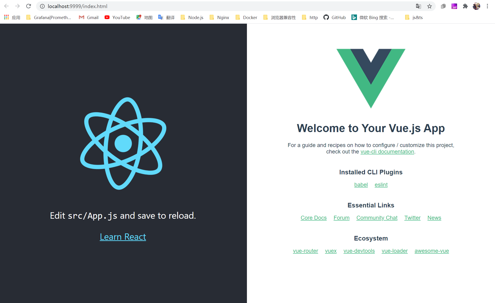

It seems not bad

?> You may find that when declaring resources, we added an "isLib" attribute, which tells bus that the current loaded resource is not an "app", but a "library". You will learn the difference between the two in subsequent studies

## Communication
Next, let's do something interesting. Let's try to make the two apps realize UI interaction through Obvious' communication mechanism. First, let's add a input box in react-app, and modify its style.
```js
import React from 'react';
import logo from './logo.svg';
import './App.css';

function App() {
  const [text, setText] = React.useState('Hello Obvious');

  const handleOnChange = (e) => {
    setText(e.target.value);
  }
  
  return (
    <div className="App">
      <header className="App-header">
        
        <div>
          <div>Edit the text showed in vue area: </div>
          <input onChange={handleOnChange} value={text}></input>
        </div>
        <a
          className="App-link"
          href="https://reactjs.org"
          target="_blank"
          rel="noopener noreferrer"
        >
          Learn React
        </a>
      </header>
    </div>
  );
}

export default App;
```
For vue-app, we change the title into the data of the app component, and then pass it to the HelloWorld component as props.
```js
// part of ./vue-app/src/App.vue
<template>
  <div id="app">
    
    <HelloWorld v-bind:msg="text"/>
  </div>
</template>

<script>
import HelloWorld from './components/HelloWorld.vue';

export default {
  name: 'App',
  components: {
    HelloWorld
  },
  data: function() {
    return {
      text: ''
    }
  }
}
</script>
```
Well, now we have two ready micro applications and a bus named host on the host environment. Bus allows messages to be passed between two applications. We only need to get the bus in the micro application code and use it to create a communication interface, the socket.
```js
import {getBus} from 'obvious-core';

const bus = getBus('host');
const socket = bus.createSocket();
```
Obvious provides a set of state management mechanism, so that different micro applications can communicate by reading, writing and listening to the same state. In our current project, what we need to do is to pass the content entered in the input box of react-app to vue-app. React-app can initialize a state named text with the socket instance just created. When the input content changes, the state value is updated in time with "socket.setstate"
```js
// part of ./react-app/src/App.js
import React from 'react';
import {getBus} from 'obvious-core';

const bus = getBus('host');
const socket = bus.createSocket();

function App() {
  const [text, setText] = React.useState('Hello Obvious');

  React.useEffect(() => {
    socket.initState('text', 'Hello Obvious');
  }, []);

  const handleOnChange = (e) => {
    setText(e.target.value);
    socket.setState('text', e.target.value);
  }

  /**
   *  omitted code
   */
}
```

!> Important rule: a state must be initialized by socket.initstate before it can be set and watched, otherwise an exception will be thrown

In vue-app, we also create a socket with the bus named host, and use this socket to listen for the state named text. When the state changes, we update the data of the component. Since we can only listen to and modify a state after it is initialized, sockets also provide a method called waitState  that allows you to wait for one or more states to be initialized before performing subsequent operations.
```js
// part of ./vue-app/src/App.vue
import HelloWorld from './components/HelloWorld.vue';
import {getBus} from 'obvious-core';

const bus = getBus('host');
const socket = bus.createSocket();

export default {
  name: 'App',
  components: {
    HelloWorld
  },
  data: function() {
    return {
      text: ''
    }
  },
  methods:{
    changeText: function(text){
      socket.waitState(['text']).then((state) => {
        this.changeText(state.text);
      });
      this.text = text;
    }
  },
  created: function() {
    socket.watchState('text', this.changeText);
  }
}
```
Now our micro-front application works like this
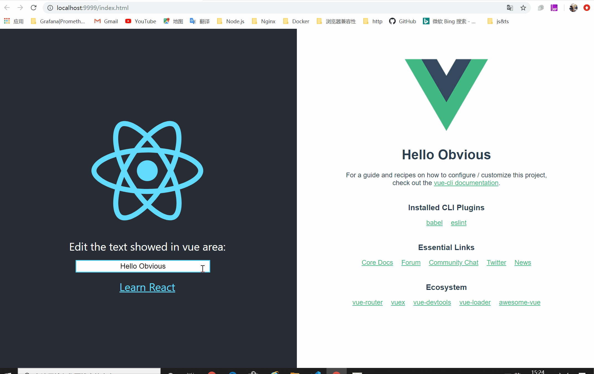

Since React and Vue are essentially state-driven frameworks, using state communication in a micro-front end is convenient and elegant, and is recommended for most cases.

?> React and Vue map data changes to UI changes through complex mechanisms, but the APIs exposed to developers are so concise and elegant that people can deeply feel the magic of software engineering. All Obvious needs to do is pass state changes between them.

In addition to state communication, Obvious also provides event communication mechanisms including broadcast and unicast. We're trying to implement the other two functions in [target](#Target) in both ways.

First we add a green button for vue-app. When we click this button, we send a broadcast event named change-rotate using the socket instance we just created。
```js
<template>
  <div class="hello">
    <h1>{{ msg }}</h1>
    <button v-on:click="changeRotate">{{ rotate ? 'stop rotate' : 'rotate' }}</button>
    <!-- omitted code -->
<template>

<script>
import {getBus} from 'obvious-core';

const bus = getBus('host');
const socket = bus.createSocket();

export default {
  name: 'HelloWorld',
  props: {
    msg: String
  },
  data: function() {
    return {
      rotate: true
    };
  },
  methods: {
    changeRotate: function() {
      this.rotate = !this.rotate;
      socket.broadcast('change-rotate', this.rotate);
    }
  }
}
</script>

<style>
// omitted code
button {
  border: none;
  outline: none;
  width: 10rem;
  height: 3rem;
  font-size: 1.5rem;
  cursor: pointer;
  color: white;
  background: #42b983
}

button:hover {
  opacity: 0.8
}
</style>
```
In react-app, we use the socket to listen for the change-rotate event in the effect hook and change the icon's class name according to event parameters to control the rotation.
```js
// part of ./react-app/src/
import React from 'react';
import logo from './logo.svg';
import { getBus } from 'obvious-core';
import './App.css';

const bus = getBus('host');
const socket = bus.createSocket();

// omit some code
function App() {
  const [logoClass, setLogoClass] = React.useState('App-logo rotate');

  React.useEffect(() => {
    const changeRotate = (rotate) => {
      if (rotate) {
        setLogoClass('App-logo rotate');
      } else {
        setLogoClass('App-logo');
      }
    };
    socket.onBroadcast('change-rotate', changeRotate);
    return () => {
      socket.offBroadcast('change-rotate', changeRotate);
    };
  }, []);
  
  return (
    <div className="App">
      <header className="App-header">
        
      </header>
    </div>
  );
}

export default App;
```

Next, we use the event unicast mechanism to realize the function that when we click the title of vue-app, react-app's input box will get focus。The usage of unicast and broadcast is very similar. The only difference is that a broadcast event can have multiple subscribers, and the callback functions of the subscription do not return a value. When a broadcast event is triggered, the event triggerer does not know if the callbacks of the event have been successfully executed. The unicast event allows only one subscriber, and the callback function of the subscription can have a return value, so that the unicast event triggerer can get the return value of the subscriber's callback, and the message transfered between the two communication parties is like an RPC call. We can say that event unicast is front-end RSC（Remote Script Call）

In this example, we have react-app subscribe to a unicast event named get-input-dom, and when the event is triggered, react-app returns the ref of the input box as a return value

```js
// part of ./react-app/src/App.js, omit some code
import React from 'react';
import { getBus } from 'obvious-core';

const bus = getBus('host');
const socket = bus.createSocket();

function App() {
  const inputRef = React.useRef(null);

  React.useEffect(() => {
    const getInputDom = () => {
      return inputRef && inputRef.current;
    };
    socket.onUnicast('get-input-dom', getInputDom);
    return () => {
      socket.offUnicast('get-input-dom', getInputDom);
    };
  }, []);
  
  return (
    <div className="App">
      <header className="App-header">
        <div>
          <div>Edit the text showed in vue area: </div>
          <input ref={inputRef} onChange={handleOnChange} value={text}></input>
        </div>
      </header>
    </div>
  );
}

export default App;
```
In vue-app, we use the socket to trigger get-input-dom unicast event in the click event callback of the title, and then get the DOM node of react-app's input boxx from the return value, and give it focus.
```js
// part of ./vue-app/src/HelloWorld.vue, omit some code
<template>
  <div class="hello">
    <h1 v-on:click="focusOnReactInput">{{ msg }}</h1>
  <div>
</template>

<script>
import {getBus} from 'obvious-core';

const bus = getBus('host');
const socket = bus.createSocket();

export default {
  name: 'HelloWorld',
  methods: {
    focusOnReactInput: function() {
      const inputDOM = socket.unicast('get-input-dom');
      inputDOM && inputDOM.focus();
    }
  }
}
</script>
```
So far, we've successfully achieved our three targets, and that's how easy it is to communicate with micro applications using Obvious!


## Application Arrangement
Now there's a small problem left over. Do you remember when we made the resource registration statement, we add an isLib attribute to both react-app and vue-app? Try removing this attribute, and you'll see that the page no longer displays properly, and there will be an error in the console panel like this: 

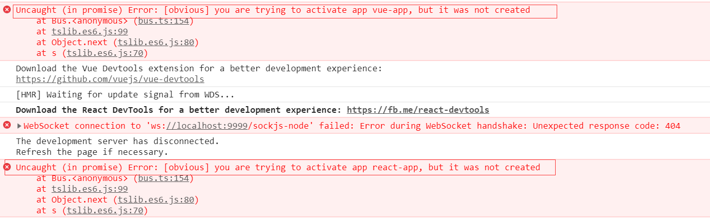

This is because Obvious divides registered micro applications into apps and librarys. Libraries are generally some third-party libraries common to many micro applications, such as React and Vue's source code, which are loaded and executed by bus once, and then used as the runtime for the whole environment. Apps, on the other hand, need to be created with a bus instance according to the rules of Obvious. Defining your micro application as an app gives your micro application a lifecycle that can be started, activated, destroyed by the bus and can receive customized parameters when it is started, activated, and destroyed.

It's easy to declare react-app as an app. Using bus.createApp in the entry function, you get an app instance
```js
// ./react-app/src/index.js
import React from 'react';
import ReactDOM from 'react-dom';
import App from './App';
import { getBus } from 'obvious-core';

const bus = getBus('host');

bus.createApp('react-app')
  .bootstrap(async (config) => {
    ReactDOM.render(
      <React.StrictMode>
        <App />
      </React.StrictMode>,
      document.querySelector(config.mountPoint)
    );
  });
```
Once an app instance is created, we render the root component in its bootstrap lifecycle, and now the mount point can be obtained from the parameters the lifecycle method directly. We'll do the same for vue-app
```js
// ./vue-app/src/main.js
import Vue from 'vue';
import App from './App.vue';
import { getBus } from 'obvious-core';

Vue.config.productionTip = false

const bus = getBus('host');

bus.createApp('vue-app')
  .bootstrap(async (config) => {
    new Vue({
        render: h => h(App),
    }).$mount(config.mountPoint);
  });
```
then we modify the activation logic in host-enviroment
```js
bus.activateApp('react-app', {
  mountPoint: '#react-app'
});
bus.activateApp('vue-app', {
  mountPoint: '#vue-app'
});
```
Your micro applications work fine again, and everything looks perfect. Now you have two micro applications. You also want to do some new development based on them, so as to become a new micro application. You can use the api called app.relyOn to realize it
```js
import { createBus } from 'obvious-core';

const bus = createBus('host').config({
  assets: {
    'react-app': {
      js: [
        'http://localhost:3001/static/js/bundle.js',
        'http://localhost:3001/static/js/0.chunk.js',
        'http://localhost:3001/static/js/1.chunk.js',
        'http://localhost:3001/static/js/main.chunk.js'
      ]
    },
    'vue-app': {
        js: [
          'http://localhost:8081/js/app.js',
          'http://localhost:8081/js/chunk-vendors.js'
        ]
    }
  }
});

bus.createApp('unit-app')
  .relyOn([{
    ctx: 'vue-app',
    config: { mountPoint: '#vue-app' }
  },{
    ctx: 'react-app',
    config: { mountPoint: '#react-app'}
  }])
  .bootstrap(async () => {
      setTimeout(() => {
         alert('I can not wait to star obvious.js');
      }, 2000);
  });

bus.activateApp('unit-app');
```
We declare a unit app which dependends on vue-app and react-app. When activated in the host environment, we will no longer activate vue-app and react-app respectively, but directly activate the combined unit-app. Bus will automatically activate its dependencies. In fact, if vue-app and react-app depend on other micro applications, this process will also be passed recursively.


Congratulations on your successful introduction to Obvious through this small demo. As you can see, learning Obvious only needs to understand three concepts：
- Bus: It is the messenger and the manager of micro applications
- App: It was created by bus so that your micro application can declare dependencies and lifecycle
- Socket：It is also created by bus. It is the communication interface of micro applications and supports state and event communication

<strong>It's so simple to build a micro front-end system with obvious!</strong>

# Advance
------
I'm sure you've probably understood what bus, app and socket are in Obvious. This chapter will take you deeper into some of their advanced usage and excellent practices

## App lifecycle
In [tutorial](#tutorial), we already know that if you want to develop an application instead of a lib, you need to create an app in the entry file and specify the life cycle for your app. Obvious has designed three life cycles for app: bootstrap, activate and destroy, which are all specified through functional APIs。
```js
const bus = getBus('host');

bus.createApp('demo-app')
  .bootstrap(async (config) => {
    // do something to bootstrap your app, e.g mount your UI
  })
  .activate(async (config) => {
    // do something to update your app, e.g change some global state
  })
  .destroy(async (config) => {
    // do something to destroy your app, e.g unmount your UI, unbind event callback
  })
```
Then you can also use bus to activate and destroy the app. The bootstrap life cycle will be called when the app is activated for the first time. You should do some initialization operations in this life cycle. After the app is activated once, activating the app again will execute the callback of the activate life cycle. You should update your micro application in this life cycle. Finally, when your app is destroyed by the bus, the destroy life cycle callback will be executed. You should do some cleaning work in this life cycle
```js
// bootstrap activate
bus.activateApp('demo-app', config1);
// reactivate
bus.activateApp('demo-app', config2);
// destroy
bus.destroyApp('demo-app', config3);
```
You don't have to specify callback functions for each life cycle. In fact, the choice of life cycle can make your application have different response effects.
- If only the bootstrap life cycle is specified, the application will execute the bootstrap callback only after the first activation, regardless of subsequent activation.
- If only the activate lifecycle is specified, the application will execute the activate callback each time it is activated
- If both bootstrap and activate lifecycles are specified, the application will execute the bootstrap callback when it is activated for the first time and the activate callback when it is activated later.


## Resource preload
As shown in the life cycle diagram, when an application is activated for the first time, if the application resources have not been loaded, the bus will first load the application resources and then excute the life cycle callback, which may slow the response of the first activation of the application. To solve this problem, bus provides the loadApp method. For some apps that do not need to be activated immediately, we can use `bus.loadApp` to load the resources corresponding to the app  when the browser is idle, but do not start the app. When the app needs to be activated, executing 'bus. Activateapp' will directly enter the life cycle callback and skip the step of loading resources
```js
bus.loadApp('demo-app').then(() => {
  bus.activateApp('demo-app');
});
```
## Shared runtime
Micro front-end architecture is an aggregation that decouples a large front-end system into multiple micro applications. Therefore, it should also be considered to avoid repeated loading of common resources of multiple micro applications. For example, there are three micro applications developed by React and two micro applications developed by Vue in your micro front-end environment. If you do not provide the source code of React and Vue as common runtime, your whole front-end system will need to load the source code of React three times and the source code of Vue twice, which has a certain impact on the application loading performance.

For this problem, Obvious also provides you with a solution. You can define the public third-party dependencies as lib when registering resources with bus
```js
const bus = createBus('host').config({
  assets:{
    react: {
      js: [
        'https://unpkg.com/react@16/umd/react.production.min.js',
        'https://unpkg.com/react-dom@16/umd/react-dom.production.min.js'
      ],
      isLib: true
    },
    'react-app': {
      js: [
        'https://host/react-app/main.js'
      ],
      css: [
        'https://host/react-app/main.css'
      ]
    }
  }
});
```
When creating an app, add the third-party dependency libs of the app through the relyOn method

?> Since the Lib that app depends on will not be loaded until the app is activated, please synchronously import the corresponding library in the form of commonJs module in the bootstrap life cycle

```js
bus.createApp('react-app')
    .relyOn([
      'react'
    ])
    .bootstrap(async (config) => {
        const React = require('react');
        const ReactDOM = require('react-dom');
        ReactDOM.render(<App />, config.mountPoint);
    });
```
At last, configure the [externals](https://webpack.docschina.org/configuration/externals/) in the webpack.
By importing third-party dependencies in this way, you can load on demand without repeated loading.

## Middleware
Next, I'll introduce you to a very practical function in obvious - Middleware. By injecting middleware, obvious can become more powerful and adapt to some large-scale front-end architecture construction.

In [App Lifecycle](#app lifecycle), we already know that when an app is activated, if the resources of the app are not loaded, the resources corresponding to the app will be loaded first. Middleware is used to help developers inject custom logic before and after loading app resources, or let developers directly take over the whole process of finding, loading and executing resources.

The middleware of obvious refers to the design and implementation of [koa](https://koajs.com/). It is a typical onion ring model.


The usage is exactly the same as that of the middleware of KOA. For example, the following middleware realizes the time-consuming function of printing when loading app resources
```js
bus.use(async (ctx, next) => {
  console.log(`start loading ${ctx.name}`);
  const startTime = Date.now();
  await next();
  const endTime = Date.now();
  console.log(`loaded, cost ${endTime - startTime}ms`);
});
```

For the type definition of context in middleware, see [ContextType](#Type). The core middleware in the onion ring is built-in. It will find app resources in `ctx.conf.assets`. If `ctx.conf.loadscriptbyfetch` is true, JS code will be loaded and executed through `ctx.fetchjs` and `ctx.excutecode`. Otherwise, script will be inserted through `ctx.loadJs`.

By writing middlewares, you can achieve many powerful functions

For example, if we want to use the free CDN service [jsdelivr](https://www.jsdelivr.com/) to load the resources of any micro application hosted on GitHub, we can write such a middleware

```js
bus.use(async(ctx, next) => {
  if (ctx.repo) {
    await ctx.loadJs(`https://cdn.jsdelivr.net/gh/${ctx.repo}/dist/main.js`);
    await ctx.loadCss(`https://cdn.jsdelivr.net/gh/${ctx.repo}/dist/main.css`);
  } else {
    await next();
  }
});
```
When starting the micro application, you only need to specify the GitHub repository name:
```js
bus.activateApp({ name: 'demo-app', repo: 'user/demo' }, { mountPoint: '#demo-app'})
```
In this way, as long as your micro application is finally packaged with /dist/main.js and /dist/main.css and hosted on GitHub, it can be directly loaded by the bus using the middleware.

For another example, you want to isolate the pollution of the global scope when executing the JS code of the micro application, so you implement a sandbox function named 'excuteScriptInSandbox'. You only need to insert such a middleware.
```js
bus.use(async(ctx, next) => {
  ctx.excuteCode = excuteScriptInSandbox;
  await next()
})
```
The 'ctx.excutecode' method called by the subsequent core middleware will be the sandbox function you implement.

## Best practice
In this section, you will learn some practical tips and useful suggestions for using Obvious
### Local debugging
You must have found that in the [tutorial](#Tutorial), if we open http://localhost:3000 and http://localhost:8081 directly, the page is blank, and such an error is reported on the console.
This is because the bus is provided by the host environment. A very important problem is how we can fully simulate the host environment locally and mock the micro applications that interact with us. Thanks to middleware, this requirement is very simple
```js
import {createBus, getBus} from 'obvious-core';

let bus = null;
if (process.env.NODE_ENV === 'development') {
  bus = createBus('host').use(async(ctx, next) => {
    const default = await import(`./your/local/mock/dicrectory/${ctx.name}.js`)
    default();
  })
} else {
  bus = getBus('host');
}
```
### As light weight as possible
We say that Obvious is a lightweight library. We can take a look at the implementation of `createBus` and `getBus`
```js
const busProxy = {};
export const createBus = (name: string) => {
    if(window.__Bus__ === undefined) {
        Object.defineProperty(window, '__Bus__', {
            value: busProxy,
            writable: false
        });
    }

    if (window.__Bus__[name]) {
        throw new Error(`[obvious] the bus named ${name} has been defined before, please rename your bus`);
    } else {
        const bus = new Bus(name);
        Object.defineProperty(window.__Bus__, name, {
            value: bus,
            writable: false
        });
        return bus;
    }
};

export const getBus = (name: string) => {
    return window.__Bus__ && window.__Bus__[name];
};
```
As you can see, `createBus` is to create a bus instance and mount it to `window__ Bus__`. And `getBus` is to get the corresponding bus instance from `window__ Bus__`. Thanks to the use of factory pattern, the app instances and socket instances in micro applications are created by calling the corresponding factory methods of bus instances, Therefore, if we don't get the bus through the `getBus` API, we write like this instead:
```js
const bus = window.__Bus__.host
```
Then we can find that there is no need to import obvious-core into micro applications. The code of Obvious only needs to be imported once in the host application

### Communicate with local bus
Next, let's talk about some suggestions in micro application communication. Obvious provides three communication modes: broadcast, unicast and global state. Although Obvious has helped you avoid the emergence of unicast events and states with the same name, broadcast events can have multiple subscribers, which may cause unnecessary trouble for some super large front-end applications. It is likely that you have agreed the name of the broadcast event with the developer of a micro application, but the event name has been used by the another app. It will lead to some unpredictable problems.

In Obvious, all the events and states are managed by the bus. If the communication between two micro applications does not use the global bus, but both parties agree on a local bus, this problem can be avoided. We suggest that the main task of the global bus is to arrange apps and manage some global states and events. The communication between two separate micro applications should use a local bus. Ideally, your micro front-end architecture should be like this:


### Control the dependencies
Although the micro front-end architecture allows you to split a large front-end system into many micro applications, please note that this division should not be abused. The business functions of micro applications should be relatively independent, and the communication between micro applications should be few and limited.

In addition, in Obvious, an app can define dependencies, which helps the integration and secondary development of micro applications. But if you don't control the dependencies well, it may bring unexpected trouble, such as this situation


When there are circular dependencies in your micro application tree, the application will not be activated. This is a typical deadlock case. In this case, try to activate the app named a, you will see such a message on the console
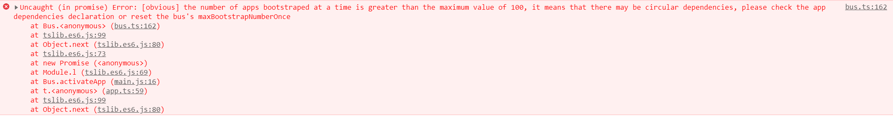
This is because in order to avoid deadlock, Obvious sets an upper limit of dependency depth for bus. The default value is 100. When a circular dependency scenario occurs, the dependency depth will increase infinitely until this threshold is reached, and an exception will be thrown，When you see this exception, you should check whether your micro application has circular dependency.

# API
------
## Type
```js
type CustomCtxType = {
  name: string;
  [key: string]: any
} | string;

type ContextType = {
  name: string;  // the name of the app to load
  loadJs: (src: string) => Promise<void>; // Insert script to load and execute JS code
  loadCss: (src: string) => void; // Insert CSS style resource
  fetchJs: (src: string) => Promise<string>; // Load code text by fetch
  excuteCode: (code: string) => void; // Execute code text
  conf:  ConfType; // Objects configured through bus.config
  [key: string]: any // custom context
};

type AssetsConfigType = Record<string, {
  js?: string[];
  css?: string[];
  isLib?: boolean;
}>;

type ConfType = {
  maxDependencyDepth?: number; // Maximum dependence depth
  loadScriptByFetch?: boolean; // Whether to load JS resources through fetch
  assets?: AssetsConfigType; // Static resource allocation
};

type DependenciesType = Array<{ 
  ctx: CustomCtxType;
  config: any
} | string>;
```
## Create and get the bus
- create the bus: **createBus**: (name) => Bus
|Parameter|required|type|description|
|:---:|:---:|:---:|:---:|
|name|yes|string|the name of the bus|

- get the Bus: **getBus**:  (name) => Bus
|Parameter|required|type|description|
|:---:|:---:|:---:|:---:|
|name|yes|string|the name of the bus|

## Bus
- property：**state**(readonly)
|type|default|description|
|:---:|:---:|:---:|
|object|null|the state managed by bus|

- configure the Bus: **config**：(conf) => Bus
|Parameter|required|type|description|
|:---:|:---:|:---:|:---:|
|conf|yes|[ConfType](#Type)|properties to update|

- apply the middleware：**use**：(middlreware) => Bus
|Parameter|required|type|description|
|:---:|:---:|:---:|:---:|
|middlreware|yes|(ctx: [ContextType](#Type), next: () => Promise<void>) => Promise<void>|The usage is the same as KOA's middleware|

- create the Socket：**createSocket**：() => Socket

- create the app：**createApp**：(name) => App
|Parameter|required|type|description|
|:---:|:---:|:---:|:---:|
|name|yes|string|the name of the app|

- load the resources of the app：**loadApp**：(ctx) => Promise<void>
|Parameter|required|type|description|
|:---:|:---:|:---:|:---:|
|ctx|yes|[CustomCtxType](#Type)|If the custom context passed to the middleware is of string type, it will be converted to `{name}`. If it is of object type, it must contain the name attribute to represent the name of the app|

- activate the App：**activateApp**：(ctx, config) => Promise<void>
|Parameter|required|type|description|
|:---:|:---:|:---:|:---:|
|ctx|yes|[CustomCtxType](#Type)|the same as loadApp|
|config|no|any|activation parameters|

- destroy the app：**destroyApp**：(name, config) => Promise<void>
|Parameter|required|type|description|
|:---:|:---:|:---:|:---:|
|name|yes|string|the name of the app|
|config|no|any|destroy parameters|

## Socket
- initialize the state：**initState**：(stateName, value) => void
|Parameter|required|type|description|
|:---:|:---:|:---:|:---:|
|stateName|yes|string|the name of the state|
|value|yes|any|the value of the state|

- determine whether the status has been initialized：**existsState**：(keyPath) => boolean
|Parameter|required|type|description|
|:---:|:---:|:---:|:---:|
|keyPath|yes|string|the key path of the state|

- get the state：**getState**: (keyPath) => any
|Parameter|required|type|description|
|:---:|:---:|:---:|:---:|
|keyPath|yes|string|the key path of the state|

- modify the state：**setState**：(keyPath, value) => void
|Parameter|required|type|description|
|:---:|:---:|:---:|:---:|
|keyPath|yes|string|the key path of the state|
|value|yes|any|the value of the state|

    Value can be passed to a function. The function's input parameter is the old state value and returns the new state value

- Listening state：**watchState**：(keyPath, callback) => void
|Parameter|required|type|description|
|:---:|:---:|:---:|:---:|
|keyPath|yes|string|the key path of the state|
|callback|yes|Function|listening callback|

- wait for states to be initialized：**waitState**： (keyPaths, timeout) => Promise
|Parameter|required|type|description|
|:---:|:---:|:---:|:---:|
|keyPaths|yes|string[]|list of waiting states' key paths|
|timeout|no|number|10 * 1000 ms by default|

    The promise returned is bus.state

> setState, getState, watchState and waitState support setting, reading, listening and waiting state values deeply. If you want to process an array in state, you only need to wrap the array subscript in the `[]` operator, such as `socket.setState('foo.bar.array[0]', value)`. initState only allows initialization of root state and does not support depth state.
When a depth state is set, the watcher function of its parent-child correlation state will be triggered. For example, there is a state `{ a: { b: { c: { d: { e: 'someValue' } } } } }`, when we call `socket.setState('a.b.c', anotherValue)`, the watcher function for a, a.b, a.b.c, a.b.c.d and a.b.c.d.e will all be triggered

- listen for broadcast：**onBroadcast**：(eventName, callback) => void
|Parameter|required|type|description|
|:---:|:---:|:---:|:---:|
|eventName|yes|string|the event name|
|callback|yes|Function|watcher callback|

- emit the broadcast：**broadcast**：(eventName， ...args) => void
|Parameter|required|type|description|
|:---:|:---:|:---:|:---:|
|eventName|yes|string|the event name|
|...args|no|any|event callback parameters|

- cancel listening broadcast：**offBroadcast**：(eventName， callback) => void
|Parameter|required|type|description|
|:---:|:---:|:---:|:---:|
|eventName|yes|string|the event name|
|callback|yes|Function|watcher callback|

    The callback for listening and canceling listening must be the same

- listen for unicast：**onUnicast**：(eventName, callback) => void
|Parameter|required|type|description|
|:---:|:---:|:---:|:---:|
|eventName|yes|string|the event name|
|callback|yes|Function|watcher callback|

- emit the unicast：**unicast**：(eventName， ...args) => any
|Parameter|required|type|description|
|:---:|:---:|:---:|:---:|
|eventName|yes|string|the event name|
|...args|no|any|event callback parameters|

- cancel listening unicast：**offUnicast**：(eventName， callback) => void
|Parameter|required|type|description|
|:---:|:---:|:---:|:---:|
|eventName|yes|string|the event name|
|callback|yes|Function|watcher callback|

    The callback for listening and canceling listening must be the same

## App
- specify dependency：**relyOn**：(dependencies) => App
|Parameter|required|type|description|
|:---:|:---:|:---:|:---:|
|dependencies|yes|[DependenciesType](#Type)|The list of dependent apps. You can specify the activation parameters passed when the dependency is activated|

- specify the bootstrap lifecycle：**bootstrap**: (lifecycleCallback) => App
|Parameter|required|type|description|
|:---:|:---:|:---:|:---:|
|lifecycleCallback|yes|(config?: any) => Promise\<void\>|callback|

- specify the activate lifecycle：**activate**：(lifecycleCallback) => App
|Parameter|required|type|description|
|:---:|:---:|:---:|:---:|
|lifecycleCallback|yes|(config?: any) => Promise\<void\>|callback|

- specify the destroy lifecycle：**destroy**：(lifecycleCallback) => App
|Parameter|required|type|description|
|:---:|:---:|:---:|:---:|
|lifecycleCallback|yes|(config?: any) => Promise\<void\>|callback|

# Q&A
------
## Why not build in application isolation
Application isolation needs to solve JS isolation and style isolation. In fact, the implementation scheme of JS sandbox has been almost fallen into a pattern，At present, the implementation scheme with the least disadvantages is proxy hijacking + borrowing iframe's contentwindow (refer to [How to implement a micro front-end sandbox](https://developer.aliyun.com/article/761449)), and style isolation is generally implemented through shadow DOM. However, in terms of my personal experience in the actual business, the benefits of application isolation are very small, and I even have to find a way to avoid the sandbox sometimes. At the same time, technically realizing a reliable application isolation solution is a high-cost work. Therefore, I finally chose not to follow the trend to realize application isolation when designing Obvious. If you do have this requirement, you can use some existing open source libraries such as [import-html-entry](https://github.com/kuitos/import-html-entry) to implement the middleware that fits in your business scenario.

And I personally recommend formulating certain standard, for example:
- The host environment should define the normalize global style.
- Integrated micro applications should not use global variables as much as possible.
- Third party libraries that pollute the global enviroment should be imported by the host environment in the form of lib
- all micro applications should use CSS modules.

## Why is it called obvious
The original intention of writing this library is that most of the articles related to the micro front-end stay in theory, which makes people feel that this concept is somewhat mysterious. I hope to help you uncover the veil of the technology with a concise and elegant API. And I happened to have a long-time-used nickname called obvious which is very consistent with my original intention, so I chose this name.

# Ecology
-------
## obvious-react
[obvious-react](https://github.com/ObviousJs/obvious-react) is the combination of Obvious and React, which helps you easily operate Obvious' state, events and apps in React applications.
## obvious-vue
[obvious-vue](https://github.com/ObviousJs/obvious-vue) is the combination of Obvious and Vue, which helps you easily operate Obvious' state, events and apps in Vue applications.

# Join us
-------
Thank you very much for seeing here. At present, I am the only one who maintains Obvious. Welcome to communicate with me in the Github's issue. And I'm also looking forward to find partners to participte in.

I hope everyone can make technological progress : )
