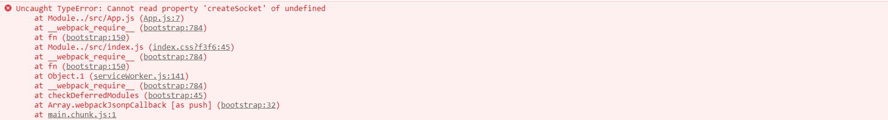

# Introduction
-----------
Obvious is a progressive micro front-end library. In the micro front-end architecture, Obvious focuses on solving the problem of arrangement and communication between micro frontend applications. It aims to help users quickly build a basic micro front-end system and support deeper customization to achieve a complete and reliable micro front-end architecture by providing APIs easy to understand and flexible middlewares.

## About micro front end
In software engineering, the front end is a field with fast speed of iterative and update. Objectively speaking, technology evolution is the result of the increase of problem's complexity and qualitative change caused by quantitative change. After the emergence of new technologies, more complex problems can be solved, and on the contrary, it drives the increase of problem's complexity. Therefore, the rapid update of the front-end shows that the front-end can do more and more things in the business, and its status is becoming more and more important.

A few years ago, the front-end developers only made some static pages and handled simple interactions. At that time, operating the native DOM or using the the sharp jQuery is enough to complete the work. Later, the popularity of Ajax brought a wave of front-end and back-end separation，much back-end developers's work was handled over to the front-end developers，they need to map a large amount of data to the UI, which means that it becomes extremely painful for developers to manually operate the DOM. At this time, The emergence of three epic projects, Angular, React and Vue, saved front-end developers in dire straits. The function of these three frameworks is to automatically map the data to the DOM in real time, so that developers can only focus on the data without operating the DOM。And then, the emergence of single page applications makes it possible to transfer data between pages without going through the backend, which makes the front end applications become more and more huge and complex. For some to-B applications, sometimes there are dozens or even hundreds of pages to manage, which can easily become fragile and difficult to maintain applications. At this time, the qualitative change caused by quantitative change is the emergence of micro front-end architecture.

We hope to introduce an architecture like back-end microservices, so that a huge front-end application can be separate to several micro applications which have the features below:
1. The technology stack between micro applications is decoupled, not aware of each other, and can be upgraded independently.
2. Each micro application provides relatively independent functions, which are developed and maintained by relatively independent teams.
3. Each micro application can be deployed and published separately, and then arranged and aggregated in a host application which is the collection of many micro applications.
4. After aggregation, micro applications have the ability to communicate with each other and can exchange data across scripts

> [micro frontend](https://martinfowler.com/articles/micro-frontends.html)

## Industry practice
Micro front end is not a new concept，but also not old either. At present, the well-known open source micro front-end frameworks include [single-spa](https://single-spa.js.org/), Alibaba's [qiankun](https://qiankun.umijs.org/zh/guide) based on single-spa. and the relatively independent micro front-end framework [icestark](https://ice.work/docs/icestark/about) which is also from Alibaba. At the same time, in various front-end conferences, many companies also shared their own micro front-end solutions. By integrating various materials on the network, we can roughly summarize several problems to be solved in the process of micro front-end landing:

1. How to register and load the resources of micro application（Arrangement）
2. How to communicate between micro applications（Communication）
3. How to ensure that global variables and styles do not affect each other between micro applications（Container）

## About Obvious
I have experienced several open source or internal micro front-end solutions in the actual business. In the process of development, I found that for the three problems mentioned above, solving the first two is more urgent. Whether there is a flexible and elegant registration and loading mechanism and convenient communication mechanism is an important indicator to measure the experience to users for a micro front-end framework. Unfortunately, I personally feel that the liraries or frameworks I tried did not give me a good experience。In China, the topic of micro front end seems to focus too much on the realization of "container"，the things like JS sandbox sound cool, but in my opinion, it seems to be a icing on the cake, in some cases, it even brings me trouble。It is for the above reasons that I came up with the idea of writing my own micro front-end framework, so I had Obvious.js

Obvious.js is a lightweight and progressive micro front-end library. It focuses on solving the arrangement and communication problems for micro applications. Its characteristics are:
- It provides the communication capability based on global state, event broadcast and event unicast, and the communication mechanism is flexible and convenient
- It supports declaring dependencies when defining micro applications. when activating micro applications it will automatically activating its dependencies, so that micro applications can be split and combined freely
- Provide flexible middleware mechanism. Users can flexibly control the loading and execution process of micro applications's resources by writing middlewares, so as to gracefully expand the functions of automatic registration of micro application resources, logs, HTML entry and JS sandbox
- It naturally supports loading multiple micro applications in a single screen page, and can encapsulate a high-level spa micro front-end framework based on it. At the same time, the micro application activation conditions are completely set by the developer, which is no longer limited to route hijacking
- The concept is simple, the API is clear and easy to understand. After learning it, users can develop with it without documentation.

This is a project I developed in my spare time. If it can help you solve business problems or inspire you. I hope you can give my repository[repository](https://github.com/ObviousJs/obvious-core)a star. It would be better if you would like to mention issue or PR to help me improve it。

Next, I will take you to develop a demo to go into the world of Obvious.js


# Tutorial
---------
> This tutorial assumes that you master the basic knowledge of React and Vue, if you don't，we recommand that you should learn them first.

## Target

经过本教程的学习，你将开发出一个效果如上图的简单微前端应用：
- 用create-react-app创建的一个react工程，被部署在 http://localhost:3000
- 用vue-cli创建的一个vue工程，被部署在 http://localhost:8081
- 上面的两个工程在 http://localhost:9999 上聚合，且在页面交互上能做到：
  - 在react区域的输入框中输入的文字，能在vue区域作为标题实时显示
  - 在vue区域可以通过点击绿色按钮控制react图标是否旋转
  - 点击vue区域的标题，react区域的输入框获得焦点

你可以在[这里](https://github.com/ObviousJs/obvious-core/tree/master/examples)查看教程示例的源码

## 准备工作
首先，我们参照[create-react-app](https://github.com/facebook/create-react-app#creating-an-app)和[vue-cli](https://cli.vuejs.org/)官方教程的说明，分别创建一个叫做react-app的react工程和一个叫做vue-app的vue工程，在本地开启dev-server伺服后，react-app被部署在 http://localhost:3000 上

vue-app被部署在 http://localhost:8081 上


为了配合之后的聚合，我们分别修改一下应用挂载点，微调一下样式，并修改publicPath

react-app做如下修改：


vue-app做如下修改：


我们最终要将这两个应用在 http://localhost:9999 上聚合，因此需要搭建一个宿主环境
> 如果不了解前端构建和Node.js的一些基础知识，下面的部分内容可能会让你感觉有些难以理解，你可以选择直接复制教程中的代码，而不必理解为什么要这么做

由于react-app和vue-app都是用webpack-dev-server伺服的，因此它们的源码中都会带上实现热更新功能的代码，如果宿主环境也是用webpack-dev-server伺服的话，错误的热更新请求会让宿主环境dev-server挂掉。因此，我们选择用webpack以watch模式打包宿主代码，并用Node.js起http服务端伺服。由于这个示例只在现代浏览器上演示，所以我们的webpack配置一切从简，只使用一个html-webpack-plugin，将打包好的代码注入到html模板中。
```js
// ./host-enviroment/main.js
alert("I'm ready to learn obvious.js");
```
```js
// ./host-enviroment/webpack.config.js
const path = require('path');
const HtmlWebpackPlugin = require('html-webpack-plugin');

module.exports = () => {
    const entry = {
        'main': path.resolve(__dirname, './main.js')
    };

    const plugins = [
        new HtmlWebpackPlugin({
            template: path.join(__dirname, './index.template.html')
        })
    ];

    return {
        entry,
        devtool: 'source-map',
        plugins
    }
};
```
在我们的宿主html中，需要为react-app和vue-app预留好挂载点, 并布置好一个应用各占屏幕一半的样式
```html
<!--  ./host-enviroment/index.template.html   -->
<!DOCTYPE html>
<html lang="en">
    <meta charset="utf-8">
    <meta http-equiv="X-UA-Compatible" content="IE=edge">
    <meta name="viewport" content="width=device-width,initial-scale=1.0">
    <title>obvious demo</title>
    <style>
        body {
            display: flex;
        }

        #react-app {
            flex: 1;
        }

        #vue-app {
            flex: 1
        }
    </style>
  </head>
  <body>
    <noscript>
      <strong>We're sorry but obvious demo doesn't work properly without JavaScript enabled. Please enable it to continue.</strong>
    </noscript>
    <div id='react-app'></div>
    <div id="vue-app"></div>
    <!-- built files will be auto injected -->
  </body>
</html>
```
打包后，所有host-enviroment的静态资源会被打包到`./dist`目录，我们在开始打包后，用express把它伺服在 http://localhost:9999 
```js
// ./host-enviroment/server.js
const express = require('express');
const child_process = require('child_process');
const path = require('path');
const fs = require('fs');

const app = new express();

if (!fs.existsSync('./dist')) {
    fs.mkdirSync('./dist');
}

const childProcess = child_process.exec('npm run watch');
childProcess.stdout.pipe(process.stdout);
childProcess.stderr.pipe(process.stderr);

app.use(express.static(path.join(__dirname, './dist/')));

app.listen('9999', () => {
    setTimeout(() => {
        child_process.execSync('start http://localhost:9999/index.html');
    }, 3000);
});
```
配置一下npm script
```json
// ./host-enviroment/package.json
{
  "name": "host-enviroment",
  "version": "0.1.0",
  "description": "",
  "main": "index.js",
  "scripts": {
    "test": "echo \"Error: no test specified\" && exit 1",
    "watch": "webpack -w",
    "start": "node ./server.js"
  },
  "author": "",
  "license": "ISC",
  "devDependencies": {
    "express": "^4.17.1",
    "html-webpack-plugin": "^4.3.0",
    "webpack": "^4.44.0",
    "webpack-cli": "^3.3.12"
  }
}
```
这样我们就完成了构建你的第一个obvious应用的第一步
```
|--- react-app
|--- vue-app
|--- host-enviroment
    |--- main.js
    |--- index.template.html
    |--- server.js
    |--- webpack.config.js
    |--- package.json
```
在host-enviroment执行一下npm start，http://localhost:9999 被打开


最后，让我们在三个工程中都安装依赖 `npm install obvious-core`

?> <strong>You are ready to learn obvious.js</strong>

## 资源注册和加载
并不难理解，react-app和vue-app上能呈现页面是因为加载了包含渲染逻辑的javaScript代码


现在我们要把这两个应用在 http://localhost:9999 上聚合，其实也只需要做同样的事情

?> 类比后端的概念，一个后端微服务本质上是一个或几个被编译为二进制的程序启动为进程后调度操作系统资源，一个前端微应用的本质是一个或几个被编译为原生js的script被加载到html中后调度DOM资源

在obvious中，专门做这件事情的是一个叫做Bus的对象，它是整个obvious微前端体系的内核，是调度不同微应用的枢纽。创建一个Bus后，你只需要把要聚合的微应用的资源信息告诉它，之后就可以用Bus提供的API调度前端资源和编排前端应用。

```js
// ./host-enviroment/main.js
import {createBus} from 'obvious-core';

const bus = createBus('host');

bus.config({
  assets: {
    'react-app': {
      js: [
        'http://localhost:3000/static/js/bundle.js',
        'http://localhost:3000/static/js/1.chunk.js',
        'http://localhost:3000/static/js/main.chunk.js'
      ],
      isLib: true
    },
    'vue-app': {
      js: [
        'http://localhost:8081/js/app.js',
        'http://localhost:8081/js/chunk-vendors.js'
      ],
      isLib: true
    }
  }
})

bus.activateApp('react-app');
bus.activateApp('vue-app');
```
我们在host-enviroment中创建了一个叫做host的Bus，声明了管理的微应用的资源，紧接着我们用创建出的Bus实例分别激活react-app和vue-app，“激活”这个操作会去加载app声明的资源，加载完成后，带着页面渲染逻辑的代码就会被执行，react和vue应用分别将各自的顶层组件挂载到我们预留好的挂载点上，页面就变成了这个样子


看起来还不错！

?> 你可能发现在声明资源时，我们添加了一个isLib属性，这告诉Bus现在加载的资源并不是一个app，而是一个library，后续的学习中你将会了解到二者的区别

## 应用通信
接下来让我们做点有趣的事情，我们尝试让两个app能靠通信机制实现UI交互，首先我们改造一下react-app，让它有一个input输入框，并微调一下它的样式：
```js
import React from 'react';
import logo from './logo.svg';
import './App.css';

function App() {
  const [text, setText] = React.useState('Hello Obvious');

  const handleOnChange = (e) => {
    setText(e.target.value);
  }
  
  return (
    <div className="App">
      <header className="App-header">
        
        <div>
          <div>Edit the text showed in vue area: </div>
          <input onChange={handleOnChange} value={text}></input>
        </div>
        <a
          className="App-link"
          href="https://reactjs.org"
          target="_blank"
          rel="noopener noreferrer"
        >
          Learn React
        </a>
      </header>
    </div>
  );
}

export default App;
```
对于vue-app，为了方便后续改造，我们把标题变成App组件的data，然后将其作为props传递给HelloWorld组件
```js
// part of ./vue-app/src/App.vue
<template>
  <div id="app">
    
    <HelloWorld v-bind:msg="text"/>
  </div>
</template>

<script>
import HelloWorld from './components/HelloWorld.vue';

export default {
  name: 'App',
  components: {
    HelloWorld
  },
  data: function() {
    return {
      text: ''
    }
  }
}
</script>
```
很好，现在我们有了两个准备就绪的微应用，在宿主环境上还有一个名为host的Bus。Bus可以让消息在两个应用之间传递。我们只需要在微应用代码中获取这个Bus，并用它创建出通信接口——Socket
```js
import {getBus} from 'obvious-core';

const bus = getBus('host');
const socket = bus.createSocket();
```
obvious提供了一套状态管理机制，让不同的微应用可以通过读、写、监听同一个状态实现通信。在我们当前这个项目中，我们需要做的是把react-app的input框输入的内容传递给vue-app。react-app可以用刚刚创建的socket实例初始化一个名为text的状态，当输入内容变化时，通过socket.setState及时更新状态值
```js
// part of ./react-app/src/App.js
import React from 'react';
import {getBus} from 'obvious-core';

const bus = getBus('host');
const socket = bus.createSocket();

function App() {
  const [text, setText] = React.useState('Hello Obvious');

  React.useEffect(() => {
    socket.initState('text', 'Hello Obvious');
  }, []);

  const handleOnChange = (e) => {
    setText(e.target.value);
    socket.setState('text', e.target.value);
  }

  /**
   *  omitted code
   */
}
```

!> 重要规则：一个状态必须通过socket.initState初始化后才能被修改和监听，否则将抛出异常

在vue-app中，我们同样用名为host的Bus创建一个socket，并用这个socket监听状态text，当状态变化时，更新组件的data。由于我们只有在状态初始化后才能监听和修改它，因此socket还提供了waitState方法，让你可以等待一个或几个状态被初始化后再执行后续操作
```js
// part of ./vue-app/src/App.vue
import HelloWorld from './components/HelloWorld.vue';
import {getBus} from 'obvious-core';

const bus = getBus('host');
const socket = bus.createSocket();

export default {
  name: 'App',
  components: {
    HelloWorld
  },
  data: function() {
    return {
      text: ''
    }
  },
  methods:{
    changeText: function(text){
      socket.waitState(['text']).then((state) => {
        this.changeText(state.text);
      });
      this.text = text;
    }
  },
  created: function() {
    socket.watchState('text', this.changeText);
  }
}
```
现在我们的微前端应用效果是这样的


由于React和Vue本质上都是状态驱动的框架，因此在微前端中使用状态通信非常方便和优雅，大多数场景都建议你使用这种通信方式。

?> 忍不住再次表达我对React和Vue两大框架的敬意，它们通过复杂的机制把数据变更映射为UI变更，暴露给开发人员的API却如此简洁优美，让人深深地感受到软件工程魅力。obvious需要做的只是把状态变更在它们之间传递而已。

除了状态通信，obvious还提供了包含广播和单播在内的事件通信机制供你使用。我们尝试用这两种方式分别实现[目标](#目标)中的另外两个功能。

首先我们为vue-app添加一个绿色按钮，当点击这个按钮的时候，我们同样使用刚刚创建好的socket实例发送一个change-rotate广播事件。
```js
<template>
  <div class="hello">
    <h1>{{ msg }}</h1>
    <button v-on:click="changeRotate">{{ rotate ? 'stop rotate' : 'rotate' }}</button>
    <!-- omitted code -->
<template>

<script>
import {getBus} from 'obvious-core';

const bus = getBus('host');
const socket = bus.createSocket();

export default {
  name: 'HelloWorld',
  props: {
    msg: String
  },
  data: function() {
    return {
      rotate: true
    };
  },
  methods: {
    changeRotate: function() {
      this.rotate = !this.rotate;
      socket.broadcast('change-rotate', this.rotate);
    }
  }
}
</script>

<style>
// omitted code
button {
  border: none;
  outline: none;
  width: 10rem;
  height: 3rem;
  font-size: 1.5rem;
  cursor: pointer;
  color: white;
  background: #42b983
}

button:hover {
  opacity: 0.8
}
</style>
```
而在react-app中，我们在Effect Hook中用socket监听change-rotate事件，并根据事件参数，更改图标类名，从而达到控制图标旋转的效果
```js
// part of ./react-app/src/
import React from 'react';
import logo from './logo.svg';
import { getBus } from 'obvious-core';
import './App.css';

const bus = getBus('host');
const socket = bus.createSocket();

// omit some code
function App() {
  const [logoClass, setLogoClass] = React.useState('App-logo rotate');

  React.useEffect(() => {
    const changeRotate = (rotate) => {
      if (rotate) {
        setLogoClass('App-logo rotate');
      } else {
        setLogoClass('App-logo');
      }
    };
    socket.onBroadcast('change-rotate', changeRotate);
    return () => {
      socket.offBroadcast('change-rotate', changeRotate);
    };
  }, []);
  
  return (
    <div className="App">
      <header className="App-header">
        
      </header>
    </div>
  );
}

export default App;
```

接下来我们用事件单播机制实现点击vue-app的标题，react-app的输入框获得焦点的功能。单播和广播的用法非常相似，唯一的区别是，广播事件可以有多个订阅者，且订阅的回调函数没有返回值，在触发广播事件时，事件触发者并不清楚事件订阅者的订阅回调是否执行成功。而单播事件只允许有一个订阅者，且订阅的回调函数有返回值，使得单播事件触发者能拿到订阅者回调的返回值，通信双方之间的消息传递像RPC调用一样有来有回，或者说，事件单播就是前端的RSC调用（Remote Script Call）

在本例中，我们让react-app订阅一个名为get-input-dom的单播事件，当事件被触发时，react-app把input框的ref作为返回值返回

```js
// part of ./react-app/src/App.js, omit some code
import React from 'react';
import { getBus } from 'obvious-core';

const bus = getBus('host');
const socket = bus.createSocket();

function App() {
  const inputRef = React.useRef(null);

  React.useEffect(() => {
    const getInputDom = () => {
      return inputRef && inputRef.current;
    };
    socket.onUnicast('get-input-dom', getInputDom);
    return () => {
      socket.offUnicast('get-input-dom', getInputDom);
    };
  }, []);
  
  return (
    <div className="App">
      <header className="App-header">
        <div>
          <div>Edit the text showed in vue area: </div>
          <input ref={inputRef} onChange={handleOnChange} value={text}></input>
        </div>
      </header>
    </div>
  );
}

export default App;
```
在vue-app中，我们在标题的点击事件回调中，用socket触发get-input-dom单播事件，拿到react-app传来的dom节点，并让它获得焦点
```js
// part of ./vue-app/src/HelloWorld.vue, omit some code
<template>
  <div class="hello">
    <h1 v-on:click="focusOnReactInput">{{ msg }}</h1>
  <div>
</template>

<script>
import {getBus} from 'obvious-core';

const bus = getBus('host');
const socket = bus.createSocket();

export default {
  name: 'HelloWorld',
  methods: {
    focusOnReactInput: function() {
      const inputDOM = socket.unicast('get-input-dom');
      inputDOM && inputDOM.focus();
    }
  }
}
</script>
```
事实上，到目前为止，我们已经成功实现了目标中的三个功能，用obvious实现微应用通信就是这么简单！


## 应用编排
现在我们还遗留着一个小问题，还记得在资源注册声明的时候，我们给react-app和vue-app都加了一个isLib属性吗，试试把这个属性去掉，你会发现页面不再正常显示，而且在控制台出现了这样的报错


这是因为，obvious把注册的微应用分为了app和library两种，library一般是多个微应用公用的一些第三方库，比如react、vue的源码，它们被bus加载并执行一次之后就完成了自己的使命，然后作为整个环境的runtime使用。而app则需要按照obvious的规则，用bus实例去创建。将你的微应用定义为app可以让你的微应用拥有生命周期，从而可以被bus启动、激活、销毁，且在启动、激活和销毁时可以接收一些定制参数。
把react-app声明为app的方法非常简单，在入口函数中使用bus.createApp，你就获得了一个app实例
```js
// ./react-app/src/index.js
import React from 'react';
import ReactDOM from 'react-dom';
import App from './App';
import { getBus } from 'obvious-core';

const bus = getBus('host');

bus.createApp('react-app')
  .bootstrap(async (config) => {
    ReactDOM.render(
      <React.StrictMode>
        <App />
      </React.StrictMode>,
      document.querySelector(config.mountPoint)
    );
  });
```
创建完app实例后，我们在它的bootstrap生命周期中渲染根组件，而且现在，我们的挂载点不需要再去跟host-enviroment约定，然后硬编码在我们的应用代码中了，而是从生命周期方法参数中获取。接着我们对vue-app做同样的改造
```js
// ./vue-app/src/main.js
import Vue from 'vue';
import App from './App.vue';
import { getBus } from 'obvious-core';

Vue.config.productionTip = false

const bus = getBus('host');

bus.createApp('vue-app')
  .bootstrap(async (config) => {
    new Vue({
        render: h => h(App),
    }).$mount(config.mountPoint);
  });
```
再把host-enviroment中的激活逻辑修改为
```js
bus.activateApp('react-app', {
  mountPoint: '#react-app'
});
bus.activateApp('vue-app', {
  mountPoint: '#vue-app'
});
```
你的微应用又可以正常显示了，一切看起来已经非常完美。最后加一个小彩蛋，现在你已经拥有了两个微应用，你还想基于它们做一些新的开发，从而变成一个新的微应用，App的依赖功能让你的这个需求变得无比简单
```js
import { createBus } from 'obvious-core';

const bus = createBus('host').config({
  assets: {
    'react-app': {
      js: [
        'http://localhost:3001/static/js/bundle.js',
        'http://localhost:3001/static/js/0.chunk.js',
        'http://localhost:3001/static/js/1.chunk.js',
        'http://localhost:3001/static/js/main.chunk.js'
      ]
    },
    'vue-app': {
        js: [
          'http://localhost:8081/js/app.js',
          'http://localhost:8081/js/chunk-vendors.js'
        ]
    }
  }
});

bus.createApp('unit-app')
  .relyOn([{
    ctx: 'vue-app',
    config: { mountPoint: '#vue-app' }
  },{
    ctx: 'react-app',
    config: { mountPoint: '#react-app'}
  }])
  .bootstrap(async () => {
      setTimeout(() => {
         alert('I can not wait to star obvious.js');
      }, 2000);
  });

bus.activateApp('unit-app');
```
我们声明一个unit-app，让它依赖vue-app和react-app，在host-environment中激活的时候，我们不再分别激活vue-app和react-app这两个原子app，而是直接激活合设的unit-app，bus会自动激活它的依赖，事实上，如果vue-app和react-app又依赖别的微应用的话，这个过程也会递归地传递下去。


恭喜你已经通过这个小demo成功入门obvious，正如你所看到的，学会obvious只需要搞懂三个概念：
- Bus: 它是消息的传递者和应用的管理者
- App: 它被Bus创建出来，让你的微应用可以声明依赖关系和生命周期
- Socket：它同样被Bus所创建，是微应用的通信接口，支持状态和事件通信

<strong>用obvious构建一个微前端体系就是这么简单！</strong>

# 进阶
------
相信你已经大概弄懂了obvious中的Bus、App和Socket是什么，本章节将带你深入它们的一些高级用法和优秀实践
## App的生命周期
在[教程](#教程)中，我们已经知道，如果你要开发的是一个应用，而不是一个lib的话，你需要在入口文件中创建App，并且可以给你的app指定生命周期。obvious为app设计了bootstrap、activate、destroy三个生命周期，它们都是通过函数式API指定的。
```js
const bus = getBus('host');

bus.createApp('demo-app')
  .bootstrap(async (config) => {
    // do something to bootstrap your app, e.g mount your UI
  })
  .activate(async (config) => {
    // do something to update your app, e.g change some global state
  })
  .destroy(async (config) => {
    // do something to destroy your app, e.g unmount your UI, unbind event callback
  })
```
然后你可以同样用bus来激活、销毁app。bootstrap生命周期会在app被第一次激活时调用，你应该在该生命周期中做一些初始化操作；app被激活过一次之后，再激活app会执行activate生命周期的回调，你应该在这个生命周期中执行更新你的微应用的操作；最后，当你的app被bus销毁时，会执行destroy生命周期回调，你应该在这个生命周期中做一些清理工作
```js
// bootstrap activate
bus.activateApp('demo-app', config1);
// reactivate
bus.activateApp('demo-app', config2);
// destroy
bus.destroyApp('demo-app', config3);
```
你不必为每个生命周期都指定回调函数，事实上，对生命周期的取舍能让你的应用有不同的响应效果。
- 如果只指定了bootstrap生命周期，应用将只在第一次被激活执行bootstrap回调，而不会理会后续的激活
- 如果只指定了activate生命周期，应用将在每次被激活时都执行activate回调
- 如果同时指定了bootstrap和activate生命周期，应用将在第一次被激活时执行bootstrap回调，在后续被激活时执行activate回调

最后，用下面这个图展示一下App的生命周期图谱


## 资源预加载
正如生命周期图谱中所示，当第一次激活应用时，如果应用的资源还没有被加载过，bus会先加载应用的资源，然后再进入生命周期回调，这可能会让应用的第一次激活响应迟缓。为了解决这个问题，bus提供了loadApp方法，对于一些不需要立刻激活的app，我们可以在浏览器空闲时执行该方法，去加载app对应的资源，但是不启动app。而当app需要被激活时，执行`bus.activateApp`就会直接进入生命周期回调，而跳过了加载资源的步骤
```js
bus.loadApp('demo-app').then(() => {
  bus.activateApp('demo-app');
});
```
## 共享运行时
微前端架构是将一个大型前端系统解耦为多个微应用的聚合。因此还应该考虑避免多个微应用的公共资源重复加载。比如，现在你的微前端环境上有三个React开发的微应用，两个Vue开发的微应用，如果不把React和Vue的源码单独抽离为公共runtime，会导致你的整个前端应用需要加载三次React的源码和两次Vue的源码，这对应用加载性能有一定影响。
针对此问题，obvious也为你提供了解决方案。你可以在向bus注册资源时，把公共的第三方依赖定义为lib
```js
const bus = createBus('host').config({
  assets:{
    react: {
      js: [
        'https://unpkg.com/react@16/umd/react.production.min.js',
        'https://unpkg.com/react-dom@16/umd/react-dom.production.min.js'
      ],
      isLib: true
    },
    'react-app': {
      js: [
        'https://host/react-app/main.js'
      ],
      css: [
        'https://host/react-app/main.css'
      ]
    }
  }
});
```
而在创建app时，通过relyOn方法将第三方依赖lib加入到app的依赖中

?> 由于app依赖的lib在app被激活时才会被加载，所以请在bootstrap生命周期中以commonJS模块的形式同步引入对应的库

```js
bus.createApp('react-app')
    .relyOn([
      'react'
    ])
    .bootstrap(async (config) => {
        const React = require('react');
        const ReactDOM = require('react-dom');
        ReactDOM.render(<App />, config.mountPoint);
    });
```
最后，在webpack中配置一下[externals](https://webpack.docschina.org/configuration/externals/)即可。
通过这种方式引入第三方依赖可以做到按需加载，且不会重复加载

## 中间件
接下来向你介绍的是obvious中一个非常实用的功能——中间件。通过注入中间件，obvious可以变得更强大，更能适应一些超大规模的前端架构建设

在[生命周期](#App的生命周期)中，我们已经知道，激活一个app时，如果app的资源未被加载，会先去加载app对应的资源。而中间件就是用来帮助开发者在加载app的资源前后注入自定义逻辑，或者让开发者直接接管查找，加载，执行资源的全过程。

obvious的中间件参考了[koa](https://koajs.com/)的设计和实现，是一个典型的洋葱圈模型


使用方法也与koa的中间件完全一样，例如下面这个中间件，就实现了在加载app资源时打印耗时的功能
```js
bus.use(async (ctx, next) => {
  console.log(`start loading ${ctx.name}`);
  const startTime = Date.now();
  await next();
  const endTime = Date.now();
  console.log(`loaded, cost ${endTime - startTime}ms`);
});
```

中间件中的上下文类型定义详见[ContextType](#类型声明)。洋葱圈中的核心中间件是内置的，它会在`ctx.conf.assets`中查找app的资源，如果`ctx.conf.loadScriptByFetch`为true，则通过`ctx.fetchJs和ctx.excuteCode`加载并执行js代码，否则通过`ctx.loadJs`插入script。

通过在中间件上做文章，你可以实现很多强大的功能。

比如，我们希望通过免费cdn服务[jsdelivr](https://www.jsdelivr.com/)加载任意一个托管在github上的微应用的资源，就可以实现这样一个中间件：

```js
bus.use(async(ctx, next) => {
  if (ctx.repo) {
    await ctx.loadJs(`https://cdn.jsdelivr.net/gh/${ctx.repo}/dist/main.js`);
    await ctx.loadCss(`https://cdn.jsdelivr.net/gh/${ctx.repo}/dist/main.css`);
  } else {
    await next();
  }
});
```
在启动微应用时，则只需要指定一下github仓库名：
```js
bus.activateApp({ name: 'demo-app', repo: 'user/demo' }, { mountPoint: '#demo-app'})
```
这样一来，只要你的微应用最终打包出/dist/main.js和/dist/main.css并托管在github上，就可以被应用了该中间件的bus直接加载了

再比如，你希望在执行微应用的js代码时能隔离其对全局作用域的污染，因此实现了一个沙箱函数`excuteScriptInSandbox`，那你只需要插入这样一个中间件
```js
bus.use(async(ctx, next) => {
  ctx.excuteCode = excuteScriptInSandbox;
  await next()
})
```
后续的核心中间件调用的`ctx.excuteCode`方法就会是你实现的沙箱函数了。

## 最佳实践
在这一小节，你将会了解到使用obvious的一些实用技巧和一些有用的建议
### 优雅地本地调试
你一定已经发现，在[教程](#教程)中，如果我们直接打开 http://localhost:3000 和 http://localhost:8081 ，页面一片空白，且控制台出现了这样的报错

这是因为Bus是连接不同微应用的枢纽，而Bus是由宿主环境提供的。一个很重要的问题是我们如何在本地能完全模拟宿主环境，并且mock与我们交互的微应用。得益于中间件，这个需求非常简单
```js
import {createBus, getBus} from 'obvious-core';

let bus = null;
if (process.env.NODE_ENV === 'development') {
  bus = createBus('host').use(async(ctx, next) => {
    const default = await import(`./your/local/mock/dicrectory/${ctx.name}.js`)
    default();
  })
} else {
  bus = getBus('host');
}
```
### 轻量级引入
我们可以看一下createBus和getBus的实现
```js
const busProxy = {};
export const createBus = (name: string) => {
    if(window.__Bus__ === undefined) {
        Object.defineProperty(window, '__Bus__', {
            value: busProxy,
            writable: false
        });
    }

    if (window.__Bus__[name]) {
        throw new Error(`[obvious] the bus named ${name} has been defined before, please rename your bus`);
    } else {
        const bus = new Bus(name);
        Object.defineProperty(window.__Bus__, name, {
            value: bus,
            writable: false
        });
        return bus;
    }
};

export const getBus = (name: string) => {
    return window.__Bus__ && window.__Bus__[name];
};
```
你可以看到，createBus就是new一个Bus实例并把它挂载到`window.__Bus__`上，而getBus就是从`window.__Bus__`上拿到对应的Bus实例。得益于工厂模式的使用，微应用中需要的App实例和Socket实例都是通过Bus实例调用工厂方法创建的。因此，如果我们不通过`getBus`api获取bus，而是直接这样写：
```js
const bus = window.__Bus__.host
```
那么其实微应用中完全没有必要引入obvious，obvious的代码只需要在宿主应用中引用一次即可

### 局部Bus通信
接下来我们聊聊微应用通信中的一点建议。obvious提供了广播、单播、全局状态三种通信方式，虽然框架层面已经帮你避免了同名单播事件和同名state的出现，但是广播事件可以有多个订阅者，对于一些超大型的前端应用来说，这可能会带来不必要的麻烦，很有可能你与一个微应用开发团队约定好一个广播事件通信，但是这个事件名其实已经被另外两个团队约定过了，而你们对这一无所知，在环境上联调的时候可能会摸不着头脑地发现你们的事件回调被莫名其妙地调用了。

在obvious中，所有的事件和状态都是由Bus管理的，如果两个微应用之间的通信不使用全局Bus，而是双方自己约定一个局部Bus，就可以避免这个问题。我们建议，全局Bus的主要任务是App调度和处理一些全局状态和事件，单独的两个微应用之间的通信应该约定局部Bus。理想情况下，你的微前端架构应该是这样的


### 合理划分微应用和控制依赖关系
最后我们来聊一聊微应用划分的问题。虽然微前端架构让你可以把大型前端系统拆分为许多个微应用。但是请注意这样的划分不应该是矫枉过正的，微应用的业务功能应该是相对独立的，微应用之间的通信应该是少量的，有限的。如果你发现两个微应用之间需要大量依靠框架通信能力，你应该考虑把这两个微应用合并为一个微应用来开发。

另外，在obvious中，一个App可以定义依赖，这助力了微应用的合设和二次开发。但是如果没有控制好依赖关系可能会带来意想不到的麻烦，比如这种情况


当你的微应用树中存在循环依赖的时候，会造成应用一直无法被激活，这是一个典型的死锁场景。这种情况试图激活A，你会在控制台看到这样的信息

obvious为了避免这种场景，给Bus设定了一个依赖深度上限，默认值是100，当出现循环依赖场景时，依赖深度会无限递增，直到达到这个阈值的时候抛出异常，当你碰到这个异常的时候，就要好好排查一下你的微应用有没有循环依赖的情况

# API
------
## 类型声明
```js
type CustomCtxType = {
  name: string;
  [key: string]: any
} | string;

type ContextType = {
  name: string;  // 要加载的app的名字
  loadJs: (src: string) => Promise<void>; // 插入script加载并执行js资源
  loadCss: (src: string) => void; // 插入css样式资源
  fetchJs: (src: string) => Promise<string>; // 通过fetch的方式加载代码文本
  excuteCode: (code: string) => void; // 执行代码文本
  conf:  ConfType; // 通过bus.config配置的对象
  [key: string]: any // 自定义context
};

type AssetsConfigType = Record<string, {
  js?: string[];
  css?: string[];
  isLib?: boolean;
}>;

type ConfType = {
  maxDependencyDepth?: number; // 最大依赖深度
  loadScriptByFetch?: boolean; // 是否通过fetch加载js资源
  assets?: AssetsConfigType; // 静态资源配置
};

type DependenciesType = Array<{ 
  ctx: CustomCtxType;
  config: any
} | string>;
```
## 创建和获取Bus
- 创建Bus: **createBus**: (name) => Bus
|参数名|是否必选|类型|描述|
|:---:|:---:|:---:|:---:|
|name|是|string|Bus名|

- 获取Bus: **getBus**:  (name) => Bus
|参数名|是否必选|类型|描述|
|:---:|:---:|:---:|:---:|
|name|是|string|Bus名|

## Bus
- 属性：**state**(readonly)
|类型|默认值|描述|
|:---:|:---:|:---:|
|object|null|Bus管理的所有状态|

- 配置Bus: **config**：(conf) => Bus
|参数名|是否必选|类型|描述|
|:---:|:---:|:---:|:---:|
|conf|是|[ConfType](#类型声明)|要更新的配置属性|

- 应用中间件：**use**：(middlreware) => Bus
|参数名|是否必选|类型|描述|
|:---:|:---:|:---:|:---:|
|middlreware|是|(ctx: [ContextType](#类型声明), next: () => Promise<void>) => Promise<void>|使用方式同koa的中间件|

- 创建App：**createApp**：(name) => App
|参数名|是否必选|类型|描述|
|:---:|:---:|:---:|:---:|
|name|是|string|App名|

- 创建Socket：**createSocket**：() => Socket

- 加载App资源：**loadApp**：(ctx) => Promise<void>
|参数名|是否必选|类型|描述|
|:---:|:---:|:---:|:---:|
|ctx|是|[CustomCtxType](#类型声明)|传递给中间件的自定义上下文，如果是string类型，则会被转化为`{ name }`, 如果是object类型，则必须包含name属性，表示app的名字|

- 激活App：**activateApp**：(ctx, config) => Promise<void>
|参数名|是否必选|类型|描述|
|:---:|:---:|:---:|:---:|
|ctx|是|[CustomCtxType](#类型声明)|同loadApp|
|config|否|any|激活参数|

- 销毁App：**destroyApp**：(name, config) => Promise<void>
|参数名|是否必选|类型|描述|
|:---:|:---:|:---:|:---:|
|name|是|string|App名|
|config|否|any|销毁参数|

## Socket
- 初始化状态：**initState**：(stateName, value) => void
|参数名|是否必选|类型|描述|
|:---:|:---:|:---:|:---:|
|stateName|是|string|状态名|
|value|是|any|状态值|

- 判断状态是否已经被初始化：**existsState**：(stateName) => boolean
|参数名|是否必选|类型|描述|
|:---:|:---:|:---:|:---:|
|stateName|是|string|状态名|

- 获取状态：**getState**: (stateName) => any
|参数名|是否必选|类型|描述|
|:---:|:---:|:---:|:---:|
|stateName|是|string|状态名|

- 修改状态：**setState**：(stateName, value) => void
|参数名|是否必选|类型|描述|
|:---:|:---:|:---:|:---:|
|stateName|是|string|状态名|
|value|是|any|状态值|

    value可以传一个函数，函数入参是旧的状态值，返回新的状态值

- 监听状态：**watchState**：(stateName, callback) => void
|参数名|是否必选|类型|描述|
|:---:|:---:|:---:|:---:|
|stateName|是|string|状态名|
|callback|是|Function|监听回调|

- 等待状态：**waitState**： (stateNames, timeout) => Promise
|参数名|是否必选|类型|描述|
|:---:|:---:|:---:|:---:|
|stateNames|是|string[]|等待的状态名列表|
|timeout|否|number|超时时间, 默认为10 * 1000|

    返回的Promise的参数是Bus.state

> setState, getState，watchState，waitState支持深度设置，读取，监听和等待状态值。例如调用`socket.setState('foo.bar', value)`, `socket.getState('foo.bar')`, `socket.watchState('foo.bar', callback)`是对bus.state.foo.bar进行设值，读取和监听，`socket.waitState(['foo.bar']， callback)`则会等待状态foo被init之后执行回调。如果要处理状态中的数组，则只需要把数组下标包裹在`[]`运算符中即可，例如`socket.setState('foo.bar.array[0]', value)`。initState仅允许初始化根状态，不支持深度状态。
当设置一个深度状态时，其父子关联状态的watcher监听函数都会被触发，例如，有一个状态`{ a: { b: { c: { d: { e: 'someValue' } } } } }`, 当调用`socket.setState('a.b.c', anotherValue)`时，对状态a, a.b, a.b.c, a.b.c.d, a.b.c.d.e的监听函数都会被触发

- 监听广播：**onBroadcast**：(eventName, callback) => void
|参数名|是否必选|类型|描述|
|:---:|:---:|:---:|:---:|
|eventName|是|string|事件名|
|callback|是|Function|事件回调|

- 触发广播：**broadcast**：(eventName， ...args) => void
|参数名|是否必选|类型|描述|
|:---:|:---:|:---:|:---:|
|eventName|是|string|事件名|
|...args|否|any|事件回调参数|

- 取消监听广播：**offBroadcast**：(eventName， callback) => void
|参数名|是否必选|类型|描述|
|:---:|:---:|:---:|:---:|
|eventName|是|string|事件名|
|callback|是|Function|事件回调|

    监听和取消监听的回调必须是同一个

- 监听单播：**onUnicast**：(eventName, callback) => void
|参数名|是否必选|类型|描述|
|:---:|:---:|:---:|:---:|
|eventName|是|string|事件名|
|callback|是|Function|事件回调|

- 触发单播：**unicast**：(eventName， ...args) => any
|参数名|是否必选|类型|描述|
|:---:|:---:|:---:|:---:|
|eventName|是|string|事件名|
|...args|否|any|事件回调参数|

- 取消监听单播：**offUnicast**：(eventName， callback) => void
|参数名|是否必选|类型|描述|
|:---:|:---:|:---:|:---:|
|eventName|是|string|事件名|
|callback|是|Function|事件回调|

    监听和取消监听的回调必须是同一个

## App
- 指定依赖：**relyOn**：(dependencies) => App
|参数名|是否必选|类型|描述|
|:---:|:---:|:---:|:---:|
|dependencies|是|[DependenciesType](#类型声明)|依赖的app列表，可以指定依赖激活时传递的激活参数|

- 指定bootstrap生命周期：**bootstrap**: (lifecycleCallback) => App
|参数名|是否必选|类型|描述|
|:---:|:---:|:---:|:---:|
|lifecycleCallback|是|(config?: any) => Promise\<void\>|指定的生命周期函数|

- 指定activate生命周期：**activate**：(lifecycleCallback) => App
|参数名|是否必选|类型|描述|
|:---:|:---:|:---:|:---:|
|lifecycleCallback|是|(config?: any) => Promise\<void\>|指定的生命周期函数|

- 指定destroy生命周期：**destroy**：(lifecycleCallback) => App
|参数名|是否必选|类型|描述|
|:---:|:---:|:---:|:---:|
|lifecycleCallback|是|(config?: any) => Promise\<void\>|指定的生命周期函数|

# Q&A
------
## 为什么不内置应用隔离功能
一般应用隔离需要解决js隔离和样式隔离。其实js沙箱的实现方案已经相对收敛，目前相对缺点最少的实现方案是proxy劫持+借用iframe的contentWindow（参考[如何“取巧”实现一个微前端沙箱](https://developer.aliyun.com/article/761449)），而样式隔离则一般通过shadowDOM实现。然而，就我个人在实际业务中的体验来说，应用隔离给我带来的收益很小，甚至时不时还得想办法规避沙箱，同时，技术上实现一个没有坑的可靠的应用隔离方案又是一项成本不低的工作，因此在设计obvious时，我最终选择不跟风去研究应用隔离。如果你确实有这方面的需求，可以结合一些已有的开源库，例如[import-html-entry](https://github.com/kuitos/import-html-entry)，封装出适合你业务场景的中间件。

而我个人更推荐在项目架构时增加一点规划和沟通成本，制定一定的规范。比如
- 宿主环境应该定义好normalize全局样式；
- 集成的微应用应该尽可能不使用全局变量；
- 对于会引入全局变量的第三方库，应该由宿主环境通过lib形式引入
- 构建时微应用都配置好css module；

## 为什么叫obvious
我写这个框架的初衷是觉得目前网上微前端相关的文章大多停留在理论，让大家觉得这个概念有些神秘，我希望能以简洁优雅的API帮助大家揭开微前端这个本来不神秘，也不高级的技术的面纱。正好我之前有一个用了很久的网名叫obvious，obvious有明显的意思，感觉跟我的初衷很契合，因此取了这个名字。

# 扩展生态
-------
## obvious-react
[obvious-react](https://github.com/ObviousJs/obvious-react)将obvious与React深度结合，帮助你在React应用中更方便地操作obvious的状态，事件和应用
## obvious-vue
[obvious-vue](https://github.com/ObviousJs/obvious-vue)将obvious与Vue深度结合，帮助你在Vue应用中轻松操作obvious的状态，事件和应用

# 加入我们
-------
非常感谢您能看到这里，目前obvious只有我一个人维护，非常欢迎在issue中与我交流，提出改进意见，更欢迎pull request参与其中

希望大家都能取得技术进步 : )
